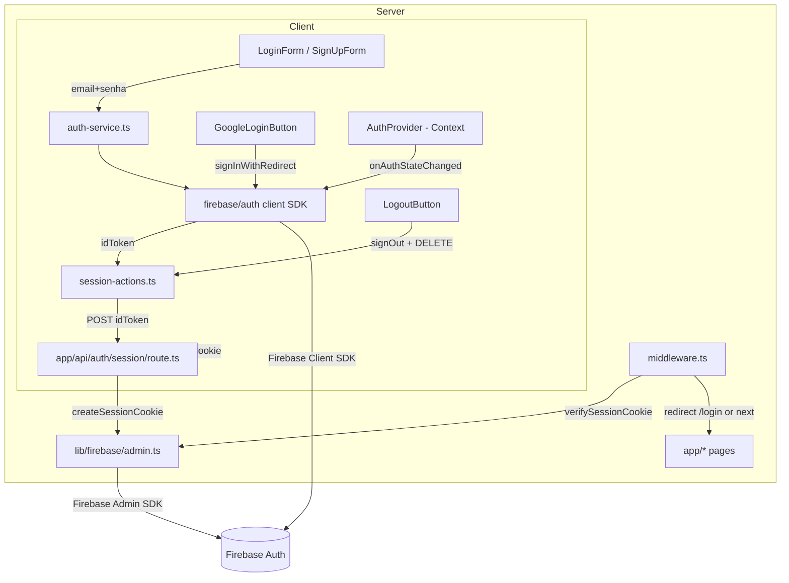

# Firebase Authentication Design

**Spec**: `.specs/features/auth/spec.md`
**Context**: `.specs/features/auth/context.md`
**Status**: Draft

---

## Architecture Overview

Client-side Firebase Auth (Google redirect + Email/Senha) issues an ID token.
That token is exchanged for a server-side session cookie via a Route Handler
using `firebase-admin`. `middleware.ts` runs in the **Node.js runtime**
(Next.js 16 supports `export const config = { runtime: 'nodejs' }` for
middleware — confirmed via docs, no longer Edge-only) and verifies that
cookie with `firebase-admin` on every request, redirecting unauthenticated
users to `/login` before any page renders.



**Request lifecycle (protected route):**
1. Browser requests `/` (or any non-`/login` route).
2. `middleware.ts` reads the `__session` cookie, calls `verifySessionCookie`.
3. Valid → `NextResponse.next()`. Invalid/missing → redirect to
   `/login?redirect=<original-path>`.

**Login lifecycle (email/senha, mirrors Google):**
1. `LoginForm` submits → `useLogin()` (`useMutation`) → `auth-service.signInWithEmail`.
2. On success, hook calls `session-actions.syncSession(idToken)` → `POST /api/auth/session`.
3. Route Handler verifies token freshness implicitly via `createSessionCookie`, sets `Set-Cookie`.
4. Hook redirects to `/` (or `?redirect` target). `AuthProvider`'s `onAuthStateChanged` listener updates `user` in Context independently (client SDK persistence already covers this).

---

## Code Reuse Analysis

### Existing Components to Leverage

| Component                          | Location                              | How to Use                                              |
| ----------------------------------- | -------------------------------------- | --------------------------------------------------------- |
| Firebase client app/auth instance   | `lib/firebase/client.ts`               | Import `auth` for all client SDK calls (signIn*, signOut, onAuthStateChanged) |
| Env validation                      | `lib/env.ts`                           | Extend with new **server-only** vars for Firebase Admin service account |
| `QueryProvider`                     | `config/providers/query-provider.tsx`  | Already wraps app — `useMutation` hooks plug in directly, no changes needed |
| shadcn `Button`                     | `components/ui/button.tsx`             | Reused by `GoogleLoginButton`, `LogoutButton`, form submit buttons |
| `cn` utility                        | `lib/utils.ts`                         | Class merging in new components |
| Root layout provider composition    | `app/layout.tsx`                       | Add `AuthProvider` to the existing `ThemeProvider > QueryProvider` nesting |

### Integration Points

| System                    | Integration Method                                                    |
| -------------------------- | ---------------------------------------------------------------------- |
| Firebase Auth (client)     | `lib/firebase/client.ts` `auth` instance, used only inside `features/auth/services` |
| Firebase Admin (server)    | New `lib/firebase/admin.ts`, used only in `middleware.ts` and `app/api/auth/session/route.ts` |
| shadcn `sonner`            | New install (`npx shadcn@latest add sonner`); `<Toaster />` added to root layout; `toast.error()` called from `features/auth/hooks` |
| Next.js middleware          | New root `middleware.ts`, Node.js runtime, matcher excludes static assets and `/login` |

---

## Components

### `features/auth/components/LoginForm.tsx`

- **Purpose**: Email/senha login form with inline Zod validation.
- **Location**: `features/auth/components/login-form.tsx`
- **Interfaces**: `<LoginForm redirectTo?: string />` — no other props, self-contained (uses `useLogin` internally).
- **Dependencies**: `react-hook-form`, `@hookform/resolvers/zod`, `zod`, `useLogin` hook.
- **Reuses**: shadcn `Button` (and `Input`/`Form`/`Label`, to be added via `npx shadcn@latest add form input label`).

### `features/auth/components/SignUpForm.tsx`

- **Purpose**: Email/senha account creation form.
- **Location**: `features/auth/components/sign-up-form.tsx`
- **Interfaces**: `<SignUpForm redirectTo?: string />`
- **Dependencies**: same as `LoginForm`, uses `useSignUp` hook.
- **Reuses**: same shared form primitives as `LoginForm` (co-locate a shared `EmailPasswordFields` component if duplication emerges — do not pre-abstract before writing both).

### `features/auth/components/GoogleLoginButton.tsx`

- **Purpose**: Triggers Google redirect login.
- **Location**: `features/auth/components/google-login-button.tsx`
- **Interfaces**: `<GoogleLoginButton redirectTo?: string />`
- **Dependencies**: `useLoginWithGoogle` hook.
- **Reuses**: shadcn `Button`.

### `features/auth/components/LogoutButton.tsx`

- **Purpose**: Triggers logout (client sign-out + server session clear).
- **Location**: `features/auth/components/logout-button.tsx`
- **Interfaces**: `<LogoutButton />`
- **Dependencies**: `useLogout` hook.
- **Reuses**: shadcn `Button`.

---

### `features/auth/hooks/use-auth.ts`

- **Purpose**: Exposes `{ user: AuthUser | null, loading: boolean }` from `AuthContext`.
- **Location**: `features/auth/hooks/use-auth.ts`
- **Interfaces**: `useAuth(): { user: AuthUser | null, loading: boolean }`
- **Dependencies**: `AuthContext` from `features/auth/components/auth-provider.tsx`.
- **Throws** if used outside `AuthProvider` (dev-time guard, not a spec requirement — defensive default).

### `features/auth/hooks/use-login.ts`, `use-sign-up.ts`, `use-login-with-google.ts`, `use-logout.ts`

- **Purpose**: `useMutation` wrappers around `services/auth-service.ts` + `actions/session-actions.ts`, plus redirect + toast side effects.
- **Location**: `features/auth/hooks/`
- **Interfaces** (all four follow the same shape):
  - `useLogin(): { mutate, mutateAsync, isPending, error }` — input `{ email: string; password: string }`
  - `useSignUp(): { ... }` — input `{ email: string; password: string }`
  - `useLoginWithGoogle(): { ... }` — no input; also exposes a `useEffect`-free `resolveRedirect()` call made once on `/login` mount to consume `getRedirectResult`
  - `useLogout(): { mutate, isPending }`
- **Dependencies**: `@tanstack/react-query`, `next/navigation` (`useRouter`), `sonner`.
- **Reuses**: `QueryProvider` already in the tree — no new provider needed for these mutations.

---

### `features/auth/services/auth-service.ts`

- **Purpose**: Thin wrapper over `firebase/auth` client SDK calls + Firebase error code → friendly pt-BR message mapping.
- **Location**: `features/auth/services/auth-service.ts`
- **Interfaces**:
  - `signInWithEmail(email: string, password: string): Promise<UserCredential>`
  - `signUpWithEmail(email: string, password: string): Promise<UserCredential>`
  - `signInWithGoogleRedirect(): Promise<void>` (calls `signInWithRedirect`)
  - `resolveGoogleRedirect(): Promise<UserCredential | null>` (calls `getRedirectResult`)
  - `signOutClient(): Promise<void>`
  - `mapFirebaseError(error: unknown): string` — returns pt-BR message
- **Dependencies**: `lib/firebase/client.ts` (`auth`), `firebase/auth` (`GoogleAuthProvider`, `signInWithEmailAndPassword`, etc.)
- **Reuses**: `lib/firebase/client.ts`.

### `features/auth/actions/session-actions.ts`

- **Purpose**: Client-side wrappers that call the session Route Handler. Named "actions" per Feature Driven Design convention, but implemented as `fetch` calls (not literal Next.js Server Actions) because Firebase's client SDK — and therefore the ID token — only exists in the browser; see context.md rationale.
- **Location**: `features/auth/actions/session-actions.ts`
- **Interfaces**:
  - `syncSession(idToken: string): Promise<void>` — `POST /api/auth/session`, throws on non-2xx
  - `clearSession(): Promise<void>` — `DELETE /api/auth/session`, throws on non-2xx
- **Dependencies**: `fetch` (browser).

### `features/auth/components/auth-provider.tsx`

- **Purpose**: Context provider syncing `onAuthStateChanged` into `{ user, loading }`.
- **Location**: `features/auth/components/auth-provider.tsx`
- **Interfaces**: `<AuthProvider>{children}</AuthProvider>`, exports `AuthContext` (internal, not in public API) and is consumed via `useAuth()`.
- **Dependencies**: `lib/firebase/client.ts` (`auth`), `onAuthStateChanged`.
- **Mounted in**: `app/layout.tsx`, nested as `ThemeProvider > QueryProvider > AuthProvider > children`.

### `features/auth/types/index.ts`

- **Purpose**: Shared types for the feature.
- **Location**: `features/auth/types/index.ts`
- **Contents**:
  ```typescript
  export interface AuthUser {
    uid: string;
    email: string | null;
    displayName: string | null;
    photoURL: string | null;
  }

  export interface EmailPasswordCredentials {
    email: string;
    password: string;
  }
  ```

### `features/auth/index.ts` (public API)

```typescript
export * from "./components/auth-provider";
export * from "./components/login-form";
export * from "./components/sign-up-form";
export * from "./components/google-login-button";
export * from "./components/logout-button";
export * from "./hooks/use-auth";
export * from "./types";
```

---

## Server-Side Pieces (outside `features/auth`, shared infra)

### `lib/firebase/admin.ts`

- **Purpose**: Initialize `firebase-admin` once (singleton, guarded like the client app), export `adminAuth`.
- **Location**: `lib/firebase/admin.ts`
- **Interfaces**: `export const adminAuth: Auth`
- **Dependencies**: `firebase-admin/app` (`cert`, `getApps`, `getApp`, `initializeApp`), `firebase-admin/auth` (`getAuth`), `lib/env.ts` (new server vars).
- **Constraint**: only ever imported from `middleware.ts` and `app/api/auth/session/route.ts` — never from client components (enforced by convention + the `"use client"` boundary, no automated guard needed at this scope).

### `middleware.ts` (project root)

- **Purpose**: Protect all routes except `/login` (and static assets) by verifying the session cookie server-side.
- **Runtime**: `export const config = { matcher: [...], runtime: "nodejs" }` — required because `firebase-admin` uses Node.js APIs incompatible with the default Edge runtime.
- **Logic**:
  ```
  if path === "/login":
    if valid session cookie → redirect to "/"
    else → next()
  else:
    if no cookie or verifySessionCookie fails → redirect to `/login?redirect=${pathname}`
    else → next()
  ```
- **Matcher**: excludes `/_next/*`, `/favicon.ico`, static file extensions, and `/api/auth/session` itself (must remain reachable to set/clear cookies).

### `app/api/auth/session/route.ts`

- **Purpose**: Route Handler creating/clearing the session cookie.
- **Methods**:
  - `POST` — body `{ idToken: string }`; calls `adminAuth.createSessionCookie(idToken, { expiresIn })`; sets `Set-Cookie` (`httpOnly`, `secure` in production, `sameSite: "lax"`, `path: "/"`, `maxAge` = 5 days); returns `204`. On invalid/expired token → `401`.
  - `DELETE` — clears the cookie (`maxAge: 0`); returns `204`.
- **Runtime**: `nodejs` (default for Route Handlers — no change needed, only middleware requires the explicit opt-in).

### `app/(auth)/login/page.tsx`

- **Purpose**: Public login page — route group so the URL stays `/login` (no `(auth)` segment in the path).
- **Contents**: Tabs or toggle between `LoginForm` and `SignUpForm`, plus `GoogleLoginButton`. Reads `?redirect=` search param and passes it down so successful login/signup navigates there instead of always `/`.
- **Calls** `resolveGoogleRedirect()` once on mount (via `useLoginWithGoogle`'s effect) to complete the Google redirect flow if the user just came back from Google.

### `app/(auth)/layout.tsx` (optional, minimal)

- Only if a distinct visual shell (centered card) is needed for `/login` vs the rest of the app. Decision: yes, minimal centered layout — consistent with typical auth page UX, low cost.

---

## Data Models

### `AuthUser` (client-side, derived from Firebase `User`)

```typescript
interface AuthUser {
  uid: string;
  email: string | null;
  displayName: string | null;
  photoURL: string | null;
}
```

**Relationships**: derived 1:1 from Firebase `User` object via a small mapper in `auth-provider.tsx` (`toAuthUser(firebaseUser)`); no persistence layer of our own — Firebase Auth is the source of truth. No Supabase table involved in this feature (out of scope per context.md).

### Session Cookie

Not a typed model — an opaque JWT string produced by `createSessionCookie`, stored as an `httpOnly` cookie named `__session` (Firebase Hosting's conventional name; works regardless of hosting provider here since we're not on Firebase Hosting, but keeping the name avoids confusion with any future Firebase Hosting integration).

---

## Error Handling Strategy

| Error Scenario                                         | Handling                                                                 | User Impact                                        |
| -------------------------------------------------------- | --------------------------------------------------------------------------- | ----------------------------------------------------- |
| Wrong password / user not found (`auth/invalid-credential`, `auth/user-not-found`, `auth/wrong-password`) | `mapFirebaseError` → pt-BR message, surfaced via `toast.error` in the mutation's `onError` | Toast: "Email ou senha incorretos" |
| Email already in use (`auth/email-already-in-use`)        | Same mapping mechanism                                                       | Toast: "Este email já está cadastrado" |
| Too many attempts (`auth/too-many-requests`)              | Same mapping mechanism                                                       | Toast: "Muitas tentativas. Tente novamente mais tarde." |
| Unmapped Firebase error code                              | Fallback branch in `mapFirebaseError`                                       | Toast: "Algo deu errado, tente novamente" |
| `POST /api/auth/session` receives invalid/expired idToken | Route Handler returns `401`; hook's `onError` treats it like any other auth failure (toast) | Toast: generic error, no session cookie set |
| `firebase-admin` fails to initialize (missing server env vars) | `lib/env.ts` schema validation throws at import time (same convention as infra-setup) | Build/dev fails loudly at startup, not silently in production |
| Session cookie present but invalid/tampered/expired       | `middleware.ts` `verifySessionCookie` throws → caught → treated as unauthenticated | Redirected to `/login`, no error shown (expected re-login flow) |
| User cancels Google redirect (denies/closes)              | `getRedirectResult` resolves to `null` — no error thrown                     | Login page just stays as-is, no toast (not a failure, a no-op) |

---

## Tech Decisions (only non-obvious ones)

| Decision                                     | Choice                                                              | Rationale |
| ---------------------------------------------- | ---------------------------------------------------------------------- | ----------- |
| Middleware runtime                             | `export const config = { runtime: "nodejs" }`                          | `firebase-admin` requires Node.js APIs; confirmed via Next.js 16 docs that middleware can opt out of the Edge runtime (stable since Next 15.5, available in the project's Next 16.2.11) — avoids needing a separate lightweight-JWT-only verification path |
| Session cookie name                            | `__session`                                                             | Conventional Firebase name; harmless even off Firebase Hosting |
| Session cookie expiry                          | 5 days (`expiresIn: 5 * 24 * 60 * 60 * 1000`)                          | Reasonable default (Agent's Discretion per context.md); renewed on next login, not silently extended |
| Redirect-back-after-login                      | `?redirect=<path>` query param read by `middleware.ts` and `app/(auth)/login/page.tsx` | Resolves the open edge case from spec.md without adding a session-based mechanism |
| `actions/` folder naming despite not being Server Actions | Keep the name per Feature Driven Design structure requested; document the reason inline (file-level comment) to avoid future confusion | Requested folder structure + Firebase client SDK constraint (browser-only APIs) are both real constraints; renaming would fight the requested convention for no benefit |
| New shadcn primitives needed                   | `form`, `input`, `label`, `sonner` (Toaster)                            | `LoginForm`/`SignUpForm` need input+label+form wiring with RHF+Zod; not present after infra-setup (only `button` was added there) |
| `firebase-admin` env vars                      | New **server-only** block in `lib/env.ts`: `FIREBASE_PROJECT_ID`, `FIREBASE_CLIENT_EMAIL`, `FIREBASE_PRIVATE_KEY` | Service account credentials must never reach the client bundle; `NEXT_PUBLIC_FIREBASE_PROJECT_ID` already exists client-side but Admin SDK needs its own explicit server credential set (client config alone is insufficient for Admin operations) |

---

## Tips followed

- Reused `lib/firebase/client.ts`, `lib/env.ts`, `QueryProvider`, `Button`, `cn` instead of re-creating them.
- Interfaces defined for every component/hook/service before implementation.
- No component does more than one thing (forms vs buttons vs provider vs services are split).
- Middleware Node.js runtime decision is the one non-obvious call that could break the whole design if wrong — verified against current Next.js 16 docs before locking it in.
