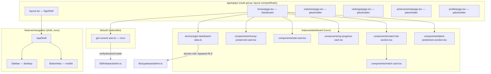

# Dashboard Design

**Spec**: `.specs/features/dashboard/spec.md`
**Context**: `.specs/features/dashboard/context.md`
**Status**: Draft

---

## Architecture Overview

Um route group `app/(app)/` agrupa as 5 rotas autenticadas (`/home`,
`/matches`, `/rankings`, `/achievements`, `/profile`) sob um layout comum
que renderiza o shell de navegação. O Dashboard (`/home`) é 100% Server
Component: resolve o usuário logado a partir do cookie de sessão Firebase,
busca dados no Supabase via service role, e renderiza os cards/listas sem
nenhum client component com estado.



**Regra de dependência:** `features/navigation` não sabe nada de
dashboard/dados — só renderiza os 5 links e destaca a rota ativa via
`usePathname` (único client component desta feature, trivial, sem
data-fetching). `features/dashboard` não sabe nada de navegação. Ambos
consumidos pelo route group `app/(app)/`.

---

## Code Reuse Analysis

### Existing Components to Leverage

| Component                             | Location                   | How to Use                                                                                       |
| ------------------------------------- | -------------------------- | ------------------------------------------------------------------------------------------------ |
| `lib/supabase/admin.ts`               | `lib/supabase/admin.ts`    | Reusado por `features/dashboard/services/get-dashboard-data.ts` (mesmo client dos sync services) |
| `lib/firebase/admin.ts` (`adminAuth`) | `lib/firebase/admin.ts`    | Reusado pelo novo `lib/auth/get-current-user.ts`                                                 |
| Padrão `app/(auth)/layout.tsx`        | `app/(auth)/layout.tsx`    | Mesmo padrão de route group + layout para `app/(app)/layout.tsx`                                 |
| shadcn `Button`                       | `components/ui/button.tsx` | Botão "Make Prediction" (desabilitado), links de navegação                                       |
| `cn` utility                          | `lib/utils.ts`             | Merge de classes nos componentes novos                                                           |
| Convenção de migration numerada       | `supabase/migrations/`     | Nova migration `00000000000014_add_gamification_columns_to_users.sql`                            |

### New shadcn Components Added

`card`, `badge`, `avatar` (via `npx shadcn@latest add card badge avatar`) —
sem dependência nova (já usa o pacote `radix-ui` unificado existente).

### Integration Points

| System                           | Integration Method                                                      |
| -------------------------------- | ----------------------------------------------------------------------- |
| Supabase Postgres (service role) | `features/dashboard/services/get-dashboard-data.ts` via `supabaseAdmin` |
| Firebase session cookie          | `lib/auth/get-current-user.ts`, lido via `next/headers` `cookies()`     |
| ESLint `no-restricted-imports`   | Override estendido para `features/dashboard/services/**/*.ts`           |

---

## Components

### `lib/auth/get-current-user.ts` (novo)

- **Purpose**: Resolver o `firebase_uid` do usuário logado dentro de
  Server Components, lendo o cookie de sessão (`__session`) e verificando
  via `adminAuth.verifySessionCookie`.
- **Interfaces**: `export async function getCurrentFirebaseUid(): Promise<string | null>`
- **Dependencies**: `next/headers` (`cookies`), `lib/firebase/admin.ts`.
- **Comportamento**: retorna `null` se não houver cookie ou se a
  verificação falhar (nunca lança) — o Dashboard trata `null` como "sem
  usuário resolvido", mesmo tratamento de zero state do usuário ausente em
  `users`.
- **Nota**: duplica a verificação já feita pelo `proxy.ts` (middleware) —
  isso é esperado no Next.js: middleware só faz gatekeeping de rota,
  Server Components resolvem identidade de forma independente.

### `features/dashboard/services/get-dashboard-data.ts` (novo)

- **Purpose**: Única função de busca de dados do Dashboard — 5 queries
  independentes via `supabaseAdmin`, em paralelo.
- **Interfaces**:
  ```typescript
  export interface DashboardData {
    stats: {
      moneySaved: number;
      currentStreak: number;
      level: number;
      xpInLevel: number;
      xpToNextLevel: number; // sempre 3000 (threshold fixo)
      accuracyPercent: number; // 0-100, arredondado
    };
    todayMatches: DashboardMatch[];
    upcomingMatches: DashboardMatch[];
    latestPredictions: DashboardPrediction[];
  }

  export interface DashboardMatch {
    id: string;
    competitionName: string;
    matchDate: string; // ISO
    homeTeamName: string;
    homeTeamShort: string; // 3 letras, derivado do nome
    awayTeamName: string;
    awayTeamShort: string;
    hasPrediction: boolean; // sempre false nesta rodada (sem predictions reais)
  }

  export interface DashboardPrediction {
    id: string;
    matchLabel: string; // "Flamengo vs Palmeiras"
    predictedScore: string; // "2-1"
    createdAt: string;
  }

  export async function getDashboardData(
    firebaseUid: string | null,
  ): Promise<DashboardData>;
  ```
- **Lógica**:
  1. Se `firebaseUid` for `null` → pula a query de `users`, usa stats
     zerados direto.
  2. `supabaseAdmin.from("users").select(...).eq("firebase_uid", firebaseUid).maybeSingle()`
     — se não achar linha, mesmo tratamento de zero state (spec DASH-01 AC3).
  3. Se achou `users`, busca `predictions` daquele `user.id` com
     `points_earned IS NOT NULL` para accuracy (`count` via
     `{ count: "exact", head: true }` 2x: total e corretos — ou 1 query
     trazendo os valores e computando em memória, mais simples dado volume
     baixo esperado).
  4. `matches` de hoje e futuras: 2 queries com `.gte`/`.lt` em
     `match_date`, embed de `competitions(name)` e `teams(name)` (via
     `home_team_id`/`away_team_id` — 2 embeds distintos, ver Tech
     Decisions sobre limitação do PostgREST aqui).
  5. `predictions` mais recentes do usuário (limit 5) — hoje sempre vazio
     (spec DASH-05).
  6. Todas as queries independentes rodam em `Promise.all`.

### `features/dashboard/components/money-preserved-card.tsx`

- **Purpose**: Hero card gradiente com o valor de `money_saved`.
- **Props**: `{ amount: number }` — formata internamente via
  `Intl.NumberFormat('pt-BR', { style: 'currency', currency: 'BRL' })`.
- **Reuses**: shadcn `Card`, `Badge` (badge "Money Preserved" no topo).

### `features/dashboard/components/stat-card.tsx`

- **Purpose**: Card genérico pra Streak/Accuracy/Level.
- **Props**:
  ```typescript
  interface StatCardProps {
    icon: LucideIcon;
    iconClassName: string; // ex: "bg-amber-100 text-amber-600"
    value: string;
    label: string;
  }
  ```
- **Reuses**: shadcn `Card`.

### `features/dashboard/components/xp-progress-card.tsx`

- **Purpose**: Card de progresso de XP (layout distinto do `StatCard`).
- **Props**: `{ level: number; xpInLevel: number; xpToNextLevel: number }`
- **Reuses**: shadcn `Card`; barra de progresso feita com `div` +
  `style={{ width: ... }}` (sem componente `Progress` do shadcn — não
  instalado; adicionar seria uma dependência nova pra uma barra simples,
  CSS puro resolve).

### `features/dashboard/components/match-card.tsx`

- **Purpose**: Card de 1 partida (usado por Today's e Upcoming Matches).
- **Props**: `{ match: DashboardMatch }`
- **Reuses**: shadcn `Card`, `Badge` (nome da competição), `Avatar` (3
  letras do time), `Button` (Make Prediction, `disabled`).

### `features/dashboard/components/match-list-section.tsx`

- **Purpose**: Título + lista horizontal/grid de `MatchCard` + estado
  vazio.
- **Props**: `{ title: string; matches: DashboardMatch[]; emptyMessage: string }`

### `features/dashboard/components/latest-predictions-section.tsx`

- **Purpose**: Lista de predictions recentes + estado vazio (sempre vazio
  por ora).
- **Props**: `{ predictions: DashboardPrediction[] }`

### `features/dashboard/index.ts` (API pública)

```typescript
export * from "./services/get-dashboard-data";
export * from "./components/money-preserved-card";
export * from "./components/stat-card";
export * from "./components/xp-progress-card";
export * from "./components/match-list-section";
export * from "./components/latest-predictions-section";
```

### `app/(app)/home/page.tsx`

- Server Component. Chama `getCurrentFirebaseUid()` → `getDashboardData()`
  → renderiza os componentes acima em sequência (hero, grid de stat
  cards + xp progress, Today's Matches, Upcoming Matches, Latest
  Predictions).

### `features/navigation/components/app-shell.tsx`, `sidebar.tsx`, `bottom-nav.tsx` (novo)

- **Purpose**: Shell de navegação — `AppShell` recebe `children`,
  renderiza `Sidebar` (`hidden md:flex`) e `BottomNav` (`flex md:hidden`)
  ao redor do conteúdo.
- `Sidebar`/`BottomNav` são **client components** (`"use client"`) — usam
  `usePathname()` do `next/navigation` pra destacar o link ativo. É o
  único client-side desta rodada, e é trivial (sem fetch, sem estado
  próprio) — não precisa de React Query.
- **Links**: Home (`/home`), Matches (`/matches`), Rankings (`/rankings`),
  Achievements (`/achievements`), Profile (`/profile`) — ícones lucide
  (`Home`, `Calendar`, `Trophy`/`Medal`, `Award`, `User`).

### `app/(app)/layout.tsx`

```typescript
import { AppShell } from "@/features/navigation";

export default function AppLayout({ children }: { children: React.ReactNode }) {
  return <AppShell>{children}</AppShell>;
}
```

### `app/(app)/{matches,rankings,achievements,profile}/page.tsx`

- 4 Server Components mínimos: título da seção + "Em breve".

---

## Data Models

### Migration `supabase/migrations/00000000000014_add_gamification_columns_to_users.sql`

```sql
ALTER TABLE users ADD COLUMN money_saved NUMERIC(10,2) NOT NULL DEFAULT 0;
ALTER TABLE users ADD COLUMN current_streak INTEGER NOT NULL DEFAULT 0;
ALTER TABLE users ADD COLUMN level INTEGER NOT NULL DEFAULT 1;
ALTER TABLE users ADD COLUMN xp INTEGER NOT NULL DEFAULT 0;
```

### `eslint.config.mjs` (modificado)

Adicionar `features/dashboard/services/**/*.ts` ao mesmo override que já
libera `features/sports-sync/services/**/*.ts` para importar
`@/lib/supabase/admin`.

### `features/auth/hooks/use-login-with-google.ts`, `use-email-password-mutation.ts` (modificados)

Trocar `router.push(redirectTo ?? "/")` por `router.push(redirectTo ?? "/home")`.

---

## Error Handling Strategy

| Error Scenario                                               | Handling                                                                                                                            | Impacto                                                                                                |
| ------------------------------------------------------------ | ----------------------------------------------------------------------------------------------------------------------------------- | ------------------------------------------------------------------------------------------------------ |
| Cookie de sessão ausente/inválido ao resolver `firebase_uid` | `getCurrentFirebaseUid()` retorna `null`, nunca lança                                                                               | Dashboard renderiza zero state (não deveria acontecer na prática, já que `proxy.ts` já bloqueou antes) |
| `users` sem linha para o `firebase_uid`                      | `get-dashboard-data.ts` trata como zero state (spec DASH-01 AC3)                                                                    | Cards mostram R$0/0 dias/0%/nível 1/0 XP                                                               |
| Nenhuma partida hoje/futura                                  | `MatchListSection` renderiza `emptyMessage`                                                                                         | Sem erro, sem seção em branco sem explicação                                                           |
| Nenhuma prediction do usuário                                | `LatestPredictionsSection` renderiza estado vazio                                                                                   | Comportamento esperado (feature de criar palpite não existe)                                           |
| Erro de rede/query do Supabase em qualquer uma das 5 queries | `Promise.all` propaga — página inteira cai no `error.tsx` do Next.js (não criado nesta rodada, comportamento default do App Router) | Página de erro genérica do Next.js — aceitável por ora                                                 |

---

## Tech Decisions (only non-obvious ones)

| Decision                                                                                            | Choice                                                                                                     | Rationale                                                                                                                                                                                                                                                            |
| --------------------------------------------------------------------------------------------------- | ---------------------------------------------------------------------------------------------------------- | -------------------------------------------------------------------------------------------------------------------------------------------------------------------------------------------------------------------------------------------------------------------- |
| Shell de navegação como feature própria (`features/navigation`), não dentro de `features/dashboard` | Sidebar/BottomNav envolvem 5 rotas, não são exclusivos do Dashboard — separar evita acoplamento indevido   | Consistente com "shared code só quando genuinamente reutilizável" do CLAUDE.md                                                                                                                                                                                       |
| Sem o componente `sidebar.tsx` completo do shadcn (SidebarProvider, collapsible, etc.)              | Sidebar custom simples, fixa, não-colapsável                                                               | O bloco oficial do shadcn resolve um problema (sidebar colapsável com estado em cookie) que o design de referência não pede — evita complexidade e código morto                                                                                                      |
| Sem componente `Progress` do shadcn pra barra de XP                                                 | `div` com `width` inline via CSS                                                                           | Barra de progresso simples não justifica instalar/manter mais um primitivo shadcn                                                                                                                                                                                    |
| `getCurrentFirebaseUid()` duplica verificação já feita no middleware                                | Aceito como padrão Next.js — middleware só faz gatekeeping, Server Components resolvem identidade próprios | Não há mecanismo built-in do Next.js pra passar o resultado do middleware pro Server Component sem reinventar via headers customizados — duplicar a verificação (barata, é só um JWT decode) é mais simples e é o padrão recomendado                                 |
| "Hoje" pra Today's Matches calculado em UTC (não horário de Brasília)                               | `new Date()` no servidor, limites de dia em UTC                                                            | **Limitação conhecida**: perto da meia-noite BRT (21h UTC), uma partida "de hoje" no fuso do Brasil pode cair como "de amanhã" no cálculo UTC. Não resolvido nesta rodada (schema não tem timezone de usuário); registrado como Agent's Discretion / melhoria futura |
| Accuracy calculada em memória (buscar predictions + contar) em vez de 2 `count` queries separadas   | Uma query trazendo `points_earned` de todas as predictions com valor não-nulo do usuário, contar no código | Volume esperado é baixo (predictions por usuário), evita 2 round-trips ao banco por 1                                                                                                                                                                                |

---

## Tips followed

- Reutilizado `lib/firebase/admin.ts`, `lib/supabase/admin.ts`, `cn`,
  shadcn `Button`, padrão de route group de `app/(auth)/layout.tsx`.
- Componentes com responsabilidade única: `StatCard` só exibe, `get-dashboard-data.ts`
  só busca, `AppShell` só estrutura — sem mistura de fetch+layout+apresentação
  no mesmo arquivo.
- `features/navigation` separada de `features/dashboard` — evita acoplar
  shell de navegação (usado por 5 rotas) a uma feature específica.
- Nenhum componente shadcn novo instalado sem necessidade real (`Progress`
  e `sidebar.tsx` completo avaliados e descartados conscientemente).
- Limitação de timezone documentada explicitamente em vez de ignorada.
