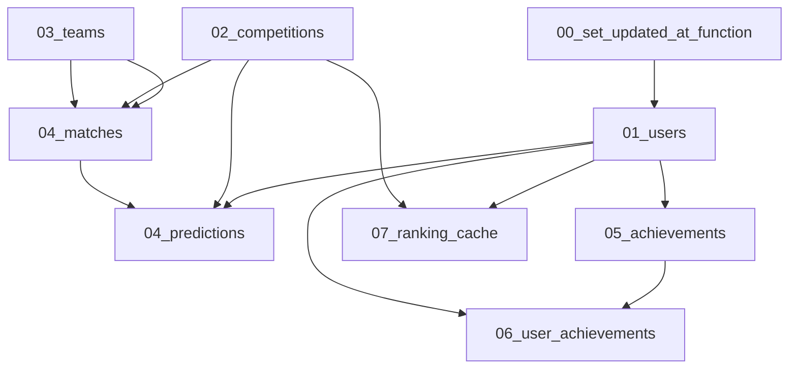

# Database Schema (Supabase) Design

**Spec**: `.specs/features/database-schema/spec.md`
**Context**: `.specs/features/database-schema/context.md`
**Status**: Draft

---

## Architecture Overview

9 arquivos de migration SQL em `supabase/migrations/`, aplicados em ordem
estrita de dependência de FK. Uma função de trigger genérica é criada uma
única vez e reaplicada tabela a tabela.



**Ordem real dos arquivos** (dependência linear):

1. `00000000000001_create_set_updated_at_function.sql`
2. `00000000000002_create_users.sql`
3. `00000000000003_create_competitions.sql`
4. `00000000000004_create_teams.sql`
5. `00000000000005_create_matches.sql` (depende de competitions, teams)
6. `00000000000006_create_predictions.sql` (depende de users, matches)
7. `00000000000007_create_achievements.sql`
8. `00000000000008_create_user_achievements.sql` (depende de users, achievements)
9. `00000000000009_create_ranking_cache.sql` (depende de users, competitions)
10. `00000000000010_enable_rls.sql` (depende de todas as 8 tabelas)

Timestamps sequenciais fake (não `YYYYMMDDHHMMSS` real) — convenção do
Supabase CLI exige apenas ordenação lexicográfica crescente; usar prefixo
numérico incremental de 14 dígitos é válido e evita depender do relógio no
momento da criação dos arquivos.

---

## Code Reuse Analysis

### Existing Components to Leverage

| Component               | Location              | How to Use                                                    |
| ------------------------ | ---------------------- | ---------------------------------------------------------------- |
| `lib/supabase/client.ts` | `lib/supabase/client.ts` | Nenhuma mudança — schema é consumido futuramente por esse client, fora do escopo desta feature |

### Integration Points

| System                        | Integration Method                                          |
| ------------------------------- | --------------------------------------------------------------- |
| Supabase Postgres (via CLI/dashboard) | Migrations aplicadas via `supabase db push` ou SQL editor do dashboard |
| Firebase Auth                 | Nenhuma integração direta no schema — `users.firebase_uid` é o único ponto de contato, populado pela aplicação (fora de escopo aqui) |

---

## Data Models

Todas as tabelas: `id UUID PRIMARY KEY DEFAULT gen_random_uuid()`.
Todos os timestamps: `TIMESTAMPTZ NOT NULL DEFAULT now()` (timezone-aware —
padrão recomendado para Postgres/Supabase, evita ambiguidade de fuso).
Todas as FKs: `ON DELETE NO ACTION` (padrão do Postgres, explícito nas
migrations) — deletar uma competição/time/usuário com dependentes é
bloqueado; a aplicação decide soft-delete ou arquivamento no futuro (fora de
escopo).

### users

```sql
id            UUID PRIMARY KEY DEFAULT gen_random_uuid()
firebase_uid  TEXT NOT NULL UNIQUE
email         TEXT
display_name  TEXT
avatar_url    TEXT
created_at    TIMESTAMPTZ NOT NULL DEFAULT now()
updated_at    TIMESTAMPTZ NOT NULL DEFAULT now()
```

Índices: `firebase_uid` já indexado pela constraint `UNIQUE`.
Trigger: `set_updated_at` BEFORE UPDATE.

### competitions

```sql
id          UUID PRIMARY KEY DEFAULT gen_random_uuid()
name        TEXT NOT NULL
slug        TEXT NOT NULL UNIQUE
season      TEXT NOT NULL
logo_url    TEXT
status      TEXT NOT NULL DEFAULT 'upcoming'
            CHECK (status IN ('upcoming', 'active', 'finished'))
created_at  TIMESTAMPTZ NOT NULL DEFAULT now()
updated_at  TIMESTAMPTZ NOT NULL DEFAULT now()
```

Índices: `status` (busca por competições ativas/próximas).
Trigger: `set_updated_at` BEFORE UPDATE.

### teams

```sql
id          UUID PRIMARY KEY DEFAULT gen_random_uuid()
name        TEXT NOT NULL
slug        TEXT NOT NULL UNIQUE
logo_url    TEXT
created_at  TIMESTAMPTZ NOT NULL DEFAULT now()
updated_at  TIMESTAMPTZ NOT NULL DEFAULT now()
```

Sem FK — entidade global (ver context.md). Trigger: `set_updated_at`.

### matches

```sql
id              UUID PRIMARY KEY DEFAULT gen_random_uuid()
competition_id  UUID NOT NULL REFERENCES competitions(id)
home_team_id    UUID NOT NULL REFERENCES teams(id)
away_team_id    UUID NOT NULL REFERENCES teams(id)
match_date      TIMESTAMPTZ NOT NULL
round           TEXT
status          TEXT NOT NULL DEFAULT 'scheduled'
                CHECK (status IN ('scheduled', 'live', 'finished', 'postponed', 'cancelled'))
home_score      INTEGER
away_score      INTEGER
created_at      TIMESTAMPTZ NOT NULL DEFAULT now()
updated_at      TIMESTAMPTZ NOT NULL DEFAULT now()
```

Índices: `competition_id`, `home_team_id`, `away_team_id`, `(status,
match_date)` composto (consultas de "próximos jogos"/"ao vivo" ordenadas por
data, identificado no review de performance).
Trigger: `set_updated_at` BEFORE UPDATE.
**Nota**: nenhum `CHECK (home_team_id <> away_team_id)` — validação de regra
de negócio, fora de escopo.

### predictions

```sql
id                    UUID PRIMARY KEY DEFAULT gen_random_uuid()
user_id               UUID NOT NULL REFERENCES users(id)
match_id              UUID NOT NULL REFERENCES matches(id)
predicted_home_score  INTEGER NOT NULL
predicted_away_score  INTEGER NOT NULL
points_earned         INTEGER
created_at            TIMESTAMPTZ NOT NULL DEFAULT now()
updated_at            TIMESTAMPTZ NOT NULL DEFAULT now()

UNIQUE (user_id, match_id)
```

Índices: `user_id`, `match_id` (a constraint UNIQUE composta já cria um
índice cobrindo `(user_id, match_id)`, mas um índice adicional em `match_id`
isolado é necessário para consultas "todos os palpites de uma partida").
Trigger: `set_updated_at` BEFORE UPDATE.

### achievements

```sql
id           UUID PRIMARY KEY DEFAULT gen_random_uuid()
name         TEXT NOT NULL
slug         TEXT NOT NULL UNIQUE
description  TEXT
icon_url     TEXT
criteria     JSONB
created_at   TIMESTAMPTZ NOT NULL DEFAULT now()
updated_at   TIMESTAMPTZ NOT NULL DEFAULT now()
```

Trigger: `set_updated_at` BEFORE UPDATE.

### user_achievements

```sql
id              UUID PRIMARY KEY DEFAULT gen_random_uuid()
user_id         UUID NOT NULL REFERENCES users(id)
achievement_id  UUID NOT NULL REFERENCES achievements(id)
earned_at       TIMESTAMPTZ NOT NULL DEFAULT now()

UNIQUE (user_id, achievement_id)
```

Índices: `user_id`, `achievement_id`.
**Sem `updated_at`/trigger** — tabela append-only (uma conquista, uma vez;
não há o que atualizar depois de `earned_at` ser gravado).

### ranking_cache

```sql
id              UUID PRIMARY KEY DEFAULT gen_random_uuid()
user_id         UUID NOT NULL REFERENCES users(id)
competition_id  UUID REFERENCES competitions(id)  -- nullable = ranking geral
points          INTEGER NOT NULL DEFAULT 0
position        INTEGER
updated_at      TIMESTAMPTZ NOT NULL DEFAULT now()

UNIQUE (user_id, competition_id)
```

Índices: `user_id`, `competition_id`, `(competition_id, points DESC)`
composto (consulta natural de leaderboard, identificado no review de
performance).
Trigger: `set_updated_at` BEFORE UPDATE.
**Sem `created_at`** — é uma tabela de cache recalculada, `updated_at` já
comunica "última atualização"; não há valor em rastrear criação.

**Nota sobre `UNIQUE (user_id, competition_id)` com NULL**: Postgres trata
cada `NULL` como distinto por padrão em constraints `UNIQUE` — ou seja, um
usuário só pode ter **uma linha por `competition_id` não-nulo específico**,
mas poderia teoricamente inserir múltiplas linhas com `competition_id NULL`
(ranking geral) sem violar a constraint, pois `NULL <> NULL`. Isso é uma
lacuna real: **mitigação** — criar um índice único parcial adicional para
garantir 1 única linha de ranking geral por usuário:

```sql
CREATE UNIQUE INDEX ranking_cache_general_unique
  ON ranking_cache (user_id)
  WHERE competition_id IS NULL;
```

Isso resolve o edge case (`UNIQUE(user_id, competition_id)` sozinho não
bloqueia duplicatas de ranking geral) sem introduzir lógica de negócio — é
puramente uma constraint de integridade.

---

## Error Handling Strategy

| Error Scenario                                       | Handling                                                        | User Impact (nível banco)          |
| ------------------------------------------------------ | ------------------------------------------------------------------- | --------------------------------------- |
| FK referencia registro inexistente                    | Postgres rejeita com `foreign_key_violation` (23503)                | `INSERT`/`UPDATE` falha, erro explícito |
| Migration aplicada fora de ordem                       | Falha na criação da FK por tabela referenciada não existir ainda    | Migration falha imediatamente, sem estado parcial ambíguo |
| `status` fora dos valores permitidos                  | Postgres rejeita com `check_violation` (23514)                      | `INSERT`/`UPDATE` falha |
| Par duplicado em `predictions`/`user_achievements`/`ranking_cache` | Postgres rejeita com `unique_violation` (23505)         | `INSERT` falha |
| 2ª linha de ranking geral (`competition_id NULL`) para o mesmo usuário | Índice único parcial `ranking_cache_general_unique` rejeita | `INSERT` falha com `unique_violation` |

---

## Tech Decisions (only non-obvious ones)

| Decision                                   | Choice                                                          | Rationale |
| -------------------------------------------- | -------------------------------------------------------------------- | ----------- |
| Timestamp type                             | `TIMESTAMPTZ` em vez de `TIMESTAMP`                                    | Timezone-aware, padrão recomendado Postgres/Supabase; evita bugs de fuso quando app rodar em servidores/regiões diferentes |
| `updated_at` em todas as tabelas?           | Não — omitido em `user_achievements` (append-only) e sem `created_at` em `ranking_cache` (é cache recalculado) | Coluna sem propósito real não deveria existir só por "consistência" |
| FK on-delete                                | `NO ACTION` (padrão Postgres, explícito)                              | Deletar registros com dependentes é decisão de aplicação (soft-delete/arquivamento), não deve ser implícito no schema — mantém "sem lógica de negócio" |
| Ranking geral único por usuário             | Índice único parcial `WHERE competition_id IS NULL`, além do `UNIQUE(user_id, competition_id)` | `UNIQUE` composto sozinho não bloqueia múltiplos `NULL` (comportamento padrão SQL) — sem o índice parcial, o requisito DB-08 (1 ranking geral por usuário) não seria garantido pelo banco |
| Índice extra em `predictions.match_id`     | Índice simples além do índice implícito da `UNIQUE(user_id, match_id)` | A constraint composta indexa `(user_id, match_id)` mas não acelera busca só por `match_id` (\"todos os palpites de uma partida\") |
| Numeração das migrations                   | Prefixo numérico incremental de 14 dígitos (`00000000000001_...`) em vez de timestamp real | Ordenação lexicográfica é o único requisito do Supabase CLI; evita depender do relógio de criação dos arquivos, mais fácil de revisar em PR |
| Extensão `pgcrypto`                        | `CREATE EXTENSION IF NOT EXISTS "pgcrypto"` declarada na primeira migration | `gen_random_uuid()` depende dessa extensão; Supabase costuma habilitá-la por padrão, mas deixar implícito é uma dependência externa não portátil — identificado no review de regressão |
| Índices adicionais de performance           | `competitions.status`, `matches (status, match_date)` composto, `ranking_cache (competition_id, points DESC)` composto | Consultas naturais do domínio (próximos jogos por status/data, leaderboard ordenado por pontos) fariam seq scan/sort sem esses índices — identificado no review de performance |

---

## Tips followed

- Reutilizado `lib/supabase/client.ts` sem alterações — esta feature só cria
  schema, não código de acesso.
- Cada tabela documentada com colunas, índices e trigger antes da
  implementação (interfaces primeiro).
- Nenhuma tabela faz mais de uma coisa — `ranking_cache` é puramente cache,
  sem lógica de cálculo embutida.
- Gap real identificado e mitigado: `UNIQUE` composto com coluna nullable
  não impede duplicatas de `NULL` — resolvido com índice parcial, mantendo
  "sem lógica de negócio" (é integridade de dado, não regra de domínio).
