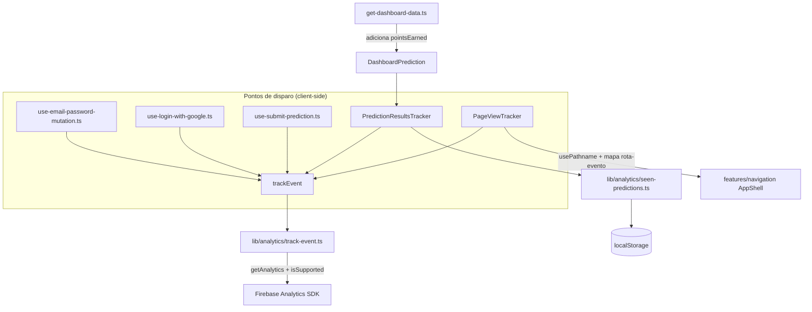

# Firebase Analytics Design

**Spec**: `.specs/features/firebase-analytics/spec.md`
**Status**: Draft

---

## Architecture Overview

Um wrapper único (`lib/analytics/track-event.ts`) centraliza toda chamada ao Firebase Analytics client SDK, com inicialização lazy e tolerante a falhas (ambiente sem suporte, adblocker). Cada um dos 5 pontos de disparo (Login, Prediction Created, Prediction Won/Lost, 3 Page Views) chama esse wrapper a partir de um client component ou client hook já existente (ou novo, no caso dos page views). Nenhum componente server-side é tocado além da extensão de tipo/query necessária para expor `pointsEarned`.



---

## Code Reuse Analysis

### Existing Components to Leverage

| Component                                                   | Location                                                                | How to Use                                                                                                 |
| ----------------------------------------------------------- | ----------------------------------------------------------------------- | ---------------------------------------------------------------------------------------------------------- |
| `lib/firebase/client.ts`                                    | `lib/firebase/client.ts`                                                | Estender para também exportar a instância `app` (Analytics precisa dela; hoje só exporta `auth`)           |
| `lib/env.ts` / `.env.example`                               | `lib/env.ts`                                                            | Adicionar `NEXT_PUBLIC_FIREBASE_MEASUREMENT_ID` ao schema `client` e ao `experimental__runtimeEnv`         |
| `use-email-password-mutation.ts`/`use-login-with-google.ts` | `features/auth/hooks/`                                                  | Adicionar `trackEvent("login")` no callback de sucesso pós-`syncSession`                                   |
| `use-submit-prediction.ts`                                  | `features/matches/hooks/`                                               | Adicionar `trackEvent("prediction_created")` dentro do `onSuccess`, após o guard `if (!result.ok) return;` |
| `get-dashboard-data.ts` (`getLatestPredictions`)            | `features/dashboard/services/`                                          | Estender query/mapeamento para incluir `points_earned` → `pointsEarned`                                    |
| `LatestPredictionsSection` / página Dashboard/Profile       | `features/dashboard/components/`, `app/(app)/home`, `app/(app)/profile` | Renderizar `PredictionResultsTracker` ao lado (mesma lista de previsões já buscada)                        |
| `AppShell`                                                  | `features/navigation/components/app-shell.tsx`                          | Renderizar `PageViewTracker` (novo) junto de `Sidebar`/`BottomNav`                                         |

### Integration Points

| System                 | Integration Method                                                                               |
| ---------------------- | ------------------------------------------------------------------------------------------------ |
| Firebase Analytics SDK | `firebase/analytics` (já incluso no pacote `firebase` já instalado), inicializado lazy no client |
| `localStorage`         | De-dup de Won/Lost — acesso direto via `window.localStorage`, sem lib externa                    |

---

## Components

### `lib/firebase/client.ts` (modificado)

- **Purpose**: Expor também a instância `app` do Firebase (hoje só expõe `auth`), necessária para `getAnalytics(app)`.
- **Mudança**: adicionar `export { app as firebaseApp };` ao final do arquivo. Nenhuma outra alteração.

### `lib/analytics/track-event.ts` (novo)

- **Purpose**: Único ponto de chamada ao Firebase Analytics — inicialização lazy, tolerante a falhas, nunca lança exceção para o chamador.
- **Location**: `lib/analytics/track-event.ts`
- **Interfaces**:
  ```typescript
  export type AnalyticsEventName =
    | "login"
    | "prediction_created"
    | "prediction_won"
    | "prediction_lost"
    | "dashboard_viewed"
    | "profile_viewed"
    | "matches_viewed";

  export function trackEvent(name: AnalyticsEventName): void;
  ```
- **Lógica**:
  1. Se `typeof window === "undefined"` (SSR/teste em ambiente node): não faz nada.
  2. Inicialização lazy: primeira chamada dispara `isSupported()` (do SDK) → se `false`, marca Analytics como indisponível e todas as chamadas seguintes são no-op; se `true`, `getAnalytics(firebaseApp)` uma única vez (cacheada em variável de módulo, nunca reinicializa).
  3. Chama `logEvent(analytics, name)` dentro de `try/catch` — qualquer erro (ex: adblocker bloqueando o transporte) é capturado e logado via `console.error`, nunca propaga.
  4. Função **não é `async`/awaited pelos chamadores** — dispara e esquece (fire-and-forget); internamente gerencia suas próprias promises de inicialização.
- **Dependencies**: `firebase/analytics`, `lib/firebase/client.ts` (`firebaseApp`)

### `lib/analytics/seen-predictions.ts` (novo)

- **Purpose**: De-duplicação de Won/Lost via `localStorage`, isolada em módulo próprio (testável sem tocar o wrapper de eventos).
- **Location**: `lib/analytics/seen-predictions.ts`
- **Interfaces**:
  ```typescript
  export function markPredictionSeen(predictionId: string): boolean;
  // true = era a primeira vez (deve disparar o evento); false = já visto (não disparar)
  ```
- **Lógica**: lê `localStorage["analytics_seen_predictions"]` (JSON de array de IDs) → `Set`; se `predictionId` já presente, retorna `false`; senão adiciona, persiste de volta, retorna `true`. Qualquer erro de acesso ao `localStorage` (ex: modo privado) é capturado — retorna `true` (comportamento degrada para "sempre dispara", aceito na interview) sem lançar exceção.
- **Dependencies**: nenhuma (usa apenas `window.localStorage`)

### `features/dashboard/components/prediction-results-tracker.tsx` (novo)

- **Purpose**: Componente invisível (`return null`) que observa a lista de previsões recentes e dispara Won/Lost para as ainda não vistas.
- **Location**: `features/dashboard/components/prediction-results-tracker.tsx`
- **Interfaces**: `PredictionResultsTracker({ predictions: DashboardPrediction[] }): null`
- **Lógica**: `useEffect` reagindo a `predictions` — para cada previsão com `pointsEarned !== null`: chama `markPredictionSeen(prediction.id)`; se retornar `true`, chama `trackEvent(pointsEarned === 1 ? "prediction_won" : "prediction_lost")`.
- **Dependencies**: `lib/analytics/track-event.ts`, `lib/analytics/seen-predictions.ts`
- **Reuses**: mesmo tipo `DashboardPrediction` já usado por `LatestPredictionsSection`; exportado via `features/dashboard/index.ts` (mesmo barrel), reaproveitado por `features/profile` exatamente como os outros componentes de dashboard já são.

### `features/navigation/components/page-view-tracker.tsx` (novo)

- **Purpose**: Componente invisível único que dispara os 3 eventos de page view com base na rota atual.
- **Location**: `features/navigation/components/page-view-tracker.tsx`
- **Interfaces**: `PageViewTracker(): null`
- **Lógica**: `usePathname()` + mapa constante `ROUTE_EVENTS: Record<string, AnalyticsEventName>` (`"/home"` → `"dashboard_viewed"`, `"/profile"` → `"profile_viewed"`, `"/matches"` → `"matches_viewed"`); `useEffect` reagindo a `pathname` — se houver entrada no mapa, chama `trackEvent`; rotas fora do mapa não disparam nada.
- **Dependencies**: `lib/analytics/track-event.ts`
- **Integração**: renderizado dentro de `AppShell`, ao lado de `Sidebar`/`BottomNav` — `AppShell` continua sem `"use client"` próprio (componentes client podem ser renderizados a partir de Server Components normalmente).

---

## Data Models

### `DashboardPrediction` (alteração de tipo)

```typescript
export interface DashboardPrediction {
  id: string;
  matchLabel: string;
  predictedScore: string;
  createdAt: string;
  pointsEarned: 0 | 1 | null; // novo — null = ainda não processada
}
```

- `features/profile/types/index.ts` não precisa de alteração — `ProfileData.latestPredictions` já reaproveita `DashboardPrediction` diretamente.
- `get-dashboard-data.ts`: query de `getLatestPredictions` passa a selecionar `points_earned` (já existe na tabela `predictions`, só não era buscado); mapeamento inclui `pointsEarned: row.points_earned`.

### Env (`lib/env.ts` + `.env.example`)

```typescript
// client schema
NEXT_PUBLIC_FIREBASE_MEASUREMENT_ID: z.string().min(1),

// experimental__runtimeEnv
NEXT_PUBLIC_FIREBASE_MEASUREMENT_ID: process.env.NEXT_PUBLIC_FIREBASE_MEASUREMENT_ID,
```

---

## Error Handling Strategy

| Error Scenario                                               | Handling                                                                  | User Impact                                                            |
| ------------------------------------------------------------ | ------------------------------------------------------------------------- | ---------------------------------------------------------------------- |
| Ambiente sem suporte a Analytics (`isSupported()` → `false`) | `trackEvent` vira no-op permanente para a sessão, sem erro                | Nenhum — silencioso                                                    |
| `logEvent` lança (adblocker, rede bloqueada)                 | `try/catch` dentro de `trackEvent`, `console.error`, nunca propaga        | Nenhum — evento simplesmente não é enviado                             |
| `localStorage` indisponível (modo privado restritivo)        | `markPredictionSeen` captura o erro, retorna `true` (dispara mesmo assim) | Possível re-disparo de Won/Lost — aceito na interview                  |
| Execução em SSR/teste (sem `window`)                         | `trackEvent` detecta `typeof window === "undefined"` e retorna cedo       | Nenhum — nunca deveria ser chamado nesse contexto, mas é seguro se for |

---

## Tech Decisions (only non-obvious ones)

| Decision                                                  | Choice                                                                                                       | Rationale                                                                                                                |
| --------------------------------------------------------- | ------------------------------------------------------------------------------------------------------------ | ------------------------------------------------------------------------------------------------------------------------ |
| `trackEvent` não é `async` do ponto de vista do chamador  | Fire-and-forget — chamadores nunca fazem `await trackEvent(...)`                                             | Analytics nunca deve bloquear UI ou fluxo de negócio; erros são sempre internos ao wrapper                               |
| Onde vive `PredictionResultsTracker`                      | `features/dashboard/components/`, reexportado via barrel para `features/profile` reaproveitar                | Mesmo padrão de reuso já estabelecido entre dashboard e profile (`StatCard`, `XpProgressCard`, etc.)                     |
| Estrutura de `lib/analytics/`                             | Dois arquivos importados por caminho direto (`track-event.ts`, `seen-predictions.ts`), sem barrel `index.ts` | Segue o padrão já usado em `lib/auth/` (`get-current-user.ts`, `middleware-logic.ts` importados diretamente, sem barrel) |
| De-dup de Won/Lost em `localStorage`, não em estado React | Set persistido via `localStorage`, lido/escrito a cada chamada                                               | Decisão explícita da interview — sobrevive a reloads de página (React state não sobreviveria), sem infra nova            |

---

## Next Step

Escopo multi-componente (novo módulo `lib/analytics/`, mudanças em env/config, 5 pontos de instrumentação em arquivos diferentes, extensão de tipo propagando por 2 features) — segue auto-sizing para escopo **Large**: próximo passo é `/taskify`.
