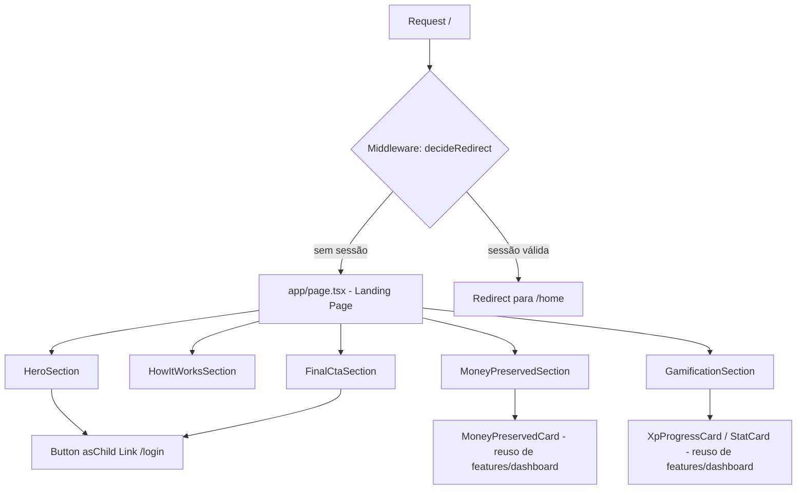

# Landing Page Design

**Spec**: `.specs/features/landing-page/spec.md`
**Status**: Draft

---

## Architecture Overview

`app/page.tsx` vira um Server Component que renderiza a landing pública, composta por 5 seções de uma nova feature `features/landing/`. O middleware (`lib/auth/middleware-logic.ts`) passa a tratar `/` como rota pública, com redirect condicional para `/home` quando há sessão válida.



---

## Code Reuse Analysis

### Existing Components to Leverage

| Component            | Location                                              | How to Use                                                |
| --------------------- | ------------------------------------------------------ | ------------------------------------------------------------ |
| `MoneyPreservedCard` | `features/dashboard/components/money-preserved-card.tsx` | Importado direto da API pública `@/features/dashboard`, com `amount` mockado |
| `XpProgressCard`     | `features/dashboard/components/xp-progress-card.tsx`   | Importado com `level`/`xpInLevel`/`xpToNextLevel` mockados |
| `StatCard`           | `features/dashboard/components/stat-card.tsx`          | Reusa para streak/precisão na seção Gamificação, mockado    |
| `Button`             | `components/ui/button.tsx`                             | `asChild` + `Link` para os dois CTAs                        |
| `Card`               | `components/ui/card.tsx`                               | Base para blocos de "Como funciona"                          |

### Integration Points

| System                        | Integration Method                                                        |
| ------------------------------ | ----------------------------------------------------------------------- |
| `lib/auth/middleware-logic.ts` | Adiciona `/` a `PUBLIC_PATHS`; generaliza redirect de sessão válida para `/home` |
| `proxy.ts` (middleware Next)   | Nenhuma mudança — já consome `decideRedirect`/`isPublicPath`             |
| `next/image`                   | Ilustrações do Hero servidas de `bet-free-images/` via `Image` do Next   |

---

## Components

### `LandingPage` (`app/page.tsx`)

- **Purpose**: Compor as 5 seções da landing, Server Component sem lógica própria.
- **Location**: `app/page.tsx`
- **Interfaces**: `export default function Home(): JSX.Element`
- **Dependencies**: componentes de `@/features/landing`
- **Reuses**: nada além da composição — lógica fica nas seções

### `HeroSection`

- **Purpose**: Headline, subheadline, ilustração e CTA principal.
- **Location**: `features/landing/components/hero-section.tsx`
- **Interfaces**: `export function HeroSection(): JSX.Element`
- **Dependencies**: `next/image` (ilustração de `bet-free-images/saved-illustration.png` ou `login-illustration.png` — escolher a que melhor comunica "poupança"), `Button` + `Link` para `/login`
- **Reuses**: `components/ui/button.tsx`

### `HowItWorksSection`

- **Purpose**: 3 passos do fluxo (palpite grátis → XP/streak → dinheiro preservado).
- **Location**: `features/landing/components/how-it-works-section.tsx`
- **Interfaces**: `export function HowItWorksSection(): JSX.Element`
- **Dependencies**: ícones `lucide-react` (consistente com `StatCard`), `Card`
- **Reuses**: `components/ui/card.tsx`

### `MoneyPreservedSection`

- **Purpose**: Mostrar `MoneyPreservedCard` com valor mockado como prova visual.
- **Location**: `features/landing/components/money-preserved-section.tsx`
- **Interfaces**: `export function MoneyPreservedSection(): JSX.Element`
- **Dependencies**: `MoneyPreservedCard` de `@/features/dashboard`
- **Reuses**: `MOCK_LANDING_STATS.moneySaved`

### `GamificationSection`

- **Purpose**: Mostrar `XpProgressCard` e `StatCard`s (streak, precisão) com dados mockados.
- **Location**: `features/landing/components/gamification-section.tsx`
- **Interfaces**: `export function GamificationSection(): JSX.Element`
- **Dependencies**: `XpProgressCard`, `StatCard` de `@/features/dashboard`
- **Reuses**: `MOCK_LANDING_STATS`

### `FinalCtaSection`

- **Purpose**: Reforço do CTA antes do rodapé.
- **Location**: `features/landing/components/final-cta-section.tsx`
- **Interfaces**: `export function FinalCtaSection(): JSX.Element`
- **Dependencies**: `Button` + `Link` para `/login`
- **Reuses**: `components/ui/button.tsx`

---

## Data Models (if applicable)

### `MOCK_LANDING_STATS`

Dados estáticos (não vêm de API/DB — landing não busca dados reais).

```typescript
// features/landing/constants/mock-stats.ts
export const MOCK_LANDING_STATS = {
  moneySaved: 342,
  level: 3,
  xpInLevel: 1200,
  xpToNextLevel: 3000,
  currentStreak: 7,
  accuracyPercent: 82,
} as const;
```

**Relationships**: Formato espelha `DashboardStats` (`features/dashboard/types.ts`) só para compatibilidade de props com os cards reutilizados — não é persistido nem validado contra o schema real.

---

## Error Handling Strategy

| Error Scenario                                                   | Handling                                                                 | User Impact                              |
| ------------------------------------------------------------------ | --------------------------------------------------------------------------- | ------------------------------------------- |
| Falha ao verificar sessão no middleware (erro Firebase/rede)      | `hasValidSession` cai para `false` (comportamento já existente em `proxy.ts`) | Trata como anônimo — landing é exibida, não bloqueia |
| Imagem do Hero não carrega                                        | `next/image` com `alt` descritivo; layout não depende da imagem para ser legível | Headline/CTA continuam visíveis            |

---

## Tech Decisions (only non-obvious ones)

| Decision                                                              | Choice                                                                                   | Rationale                                                                                     |
| ------------------------------------------------------------------------ | --------------------------------------------------------------------------------------------- | -------------------------------------------------------------------------------------------------- |
| Redirect de rota pública com sessão válida                          | Generalizar `decideRedirect`: público + sessão válida → redirect para `/home` (era hardcoded `"/"`) | Com `/` virando pública, redirecionar pra `"/"` causaria loop de volta à própria landing; `/login` também deve passar a redirecionar pra `/home`, não `/` |
| Teste existente `tests/lib/auth/middleware-logic.test.ts` (`/login` + sessão válida → `/`) | Atualizar expectativa para `/home`                                                        | Consequência direta da mudança acima — precisa ser ajustado junto                              |
| Nova feature `features/landing/`                                     | Criar pasta própria com `index.ts` (padrão feature-first do projeto), em vez de colocar seções direto em `app/` | Consistente com `CLAUDE.md` (Feature Public API) e mantém `app/page.tsx` fino                 |
| Dados mockados                                                       | Constante estática em `features/landing/constants/mock-stats.ts`, sem fetch/serviço          | Landing não integra com backend real (fora de escopo, ver spec.md) — mock deve ser óbvio como tal |

---
