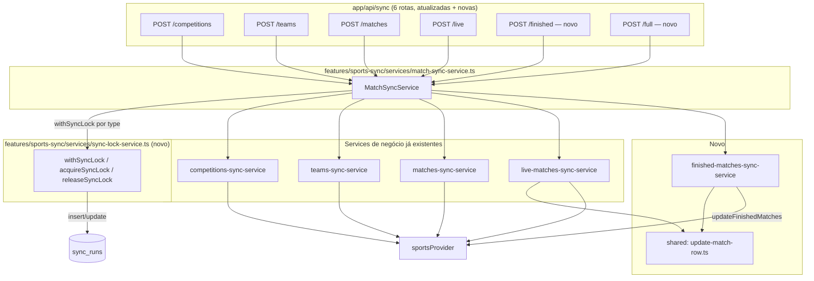

# Match Sync Engine Design

**Spec**: `.specs/features/match-sync-engine/spec.md`
**Context**: `.specs/features/match-sync-engine/context.md`
**Status**: Draft

---

## Architecture Overview

`MatchSyncService` é a única camada nova de orquestração. Ela não contém
lógica de negócio própria (além do lock) — delega para os 4 services já
existentes + 1 novo (`finished-matches-sync-service`), cada chamada
protegida por um lock persistente em `sync_runs`.



**Regra de dependência:** `MatchSyncService` e `sync-lock-service` vivem em
`features/sports-sync/services/` (lógica de negócio/orquestração — não em
`lib/`, ao contrário de `lib/concurrency.ts`/`lib/sync-auth.ts`, que são
primitivas genéricas sem conhecimento de "sync"). `sync-lock-service`
conhece a tabela `sync_runs` e o conceito de "tipo de sync" — isso é
domínio da feature, não infraestrutura reutilizável por qualquer feature
futura.

---

## Code Reuse Analysis

### Existing Components to Leverage

| Component                                         | Location                                                     | How to Use                                                                                                                                   |
| ------------------------------------------------- | ------------------------------------------------------------ | -------------------------------------------------------------------------------------------------------------------------------------------- |
| `mapWithConcurrency`, `DEFAULT_CONCURRENCY_LIMIT` | `lib/concurrency.ts`                                         | Reusado em `finished-matches-sync-service` para limitar chamadas por competição, mesmo padrão de `teams-sync-service`/`matches-sync-service` |
| `isValidSyncSecret`                               | `lib/sync-auth.ts`                                           | Reusado sem alteração nas 2 rotas novas                                                                                                      |
| `supabaseAdmin`                                   | `lib/supabase/admin.ts`                                      | Reusado por `sync-lock-service` e `finished-matches-sync-service`                                                                            |
| `sportsProvider`                                  | `lib/sports-provider`                                        | `updateFinishedMatches` adicionado à interface, implementado só em `TheSportsDBProvider`                                                     |
| Padrão upsert-only-update (nunca insert)          | `features/sports-sync/services/live-matches-sync-service.ts` | Extraído para função compartilhada `update-match-row.ts`, reusada por `live` e `finished`                                                    |
| 4 services de sync existentes                     | `features/sports-sync/services/*`                            | Consumidos como estão, sem modificação de assinatura                                                                                         |
| Convenção de migration numerada                   | `supabase/migrations/`                                       | Nova migration `00000000000012_create_sync_runs.sql`                                                                                         |

### Integration Points

| System                                      | Integration Method                                                                                       |
| ------------------------------------------- | -------------------------------------------------------------------------------------------------------- |
| TheSportsDB API v1 (`eventspastleague.php`) | Novo método `updateFinishedMatches` em `TheSportsDBProvider`, mesmo padrão de `fetchJson`+Zod dos demais |
| Supabase Postgres (`sync_runs`)             | Novo `sync-lock-service.ts`, índice único parcial para atomicidade do lock                               |
| Route Handlers Next.js                      | 4 atualizadas + 2 novas, todas com o mesmo padrão de auth + try/catch                                    |

---

## Components

### Migration `supabase/migrations/00000000000012_create_sync_runs.sql`

```sql
CREATE TABLE sync_runs (
  id          UUID PRIMARY KEY DEFAULT gen_random_uuid(),
  type        TEXT NOT NULL
              CHECK (type IN ('competitions', 'teams', 'matches', 'live', 'finished')),
  status      TEXT NOT NULL DEFAULT 'running'
              CHECK (status IN ('running', 'finished', 'failed')),
  started_at  TIMESTAMPTZ NOT NULL DEFAULT now(),
  finished_at TIMESTAMPTZ
);

CREATE INDEX sync_runs_type_idx ON sync_runs (type);

-- Atomicidade do lock: só pode existir 1 linha 'running' por type ao mesmo
-- tempo. Um segundo INSERT concorrente para o mesmo type falha aqui
-- (unique_violation), não numa checagem SELECT-then-INSERT sujeita a race.
CREATE UNIQUE INDEX sync_runs_one_running_per_type
  ON sync_runs (type)
  WHERE status = 'running';
```

**Nota:** RLS já está `deny-all` em todas as tabelas do schema
(`00000000000010_enable_rls.sql`); `sync_runs` deveria seguir o mesmo
padrão — nova migration inclui `ALTER TABLE sync_runs ENABLE ROW LEVEL
SECURITY` + policy `deny_all` idêntica às demais 8 tabelas, por
consistência (não estava explícito no context.md, mas é a mesma decisão já
tomada para todo o schema).

### `lib/sports-provider/types.ts` (modificado)

```typescript
export interface SportsProvider {
  readonly source: string;
  syncCompetitions(): Promise<ProviderCompetition[]>;
  syncTeams(externalCompetitionId: string): Promise<ProviderTeam[]>;
  syncMatches(
    externalCompetitionId: string,
    season: string,
  ): Promise<ProviderMatch[]>;
  updateLiveMatches(): Promise<ProviderMatch[]>;
  updateFinishedMatches(
    externalCompetitionId: string,
  ): Promise<ProviderMatch[]>;
}
```

### `lib/sports-provider/thesportsdb-provider.ts` (modificado)

- **Novo método**: `updateFinishedMatches(externalCompetitionId)` — `GET
eventspastleague.php?id={encodeURIComponent(externalCompetitionId)}`,
  reutiliza `eventsResponseSchema` (mesmo shape de evento de
  `syncMatches`/`updateLiveMatches`) e o mesmo `mapStatus`/`toISODateTime`.
- Mesma disciplina de erro: falha de rede/shape → `SportsProviderError`
  imediato, sem retry.

### `features/sports-sync/services/sync-lock-service.ts` (novo)

- **Purpose**: Adquirir/liberar o lock de execução por tipo de sync,
  usando `sync_runs`.
- **Interfaces**:
  ```typescript
  export type SyncType =
    "competitions" | "teams" | "matches" | "live" | "finished";

  export class SyncAlreadyRunningError extends Error {
    constructor(readonly type: SyncType) {
      super(`Sync already running for type "${type}"`);
      this.name = "SyncAlreadyRunningError";
    }
  }

  export async function withSyncLock<T>(
    type: SyncType,
    fn: () => Promise<T>,
  ): Promise<T>;
  ```
- **Lógica de `withSyncLock`**:
  1. `UPDATE sync_runs SET status='failed', finished_at=now() WHERE type=$type AND status='running' AND started_at < now() - interval '10 minutes'` — reap de locks stale (processo morto sem finalizar).
  2. `INSERT INTO sync_runs (type, status) VALUES ($type, 'running')`. Se falhar por `unique_violation` (índice `sync_runs_one_running_per_type`), lança `SyncAlreadyRunningError`.
  3. Executa `fn()`.
  4. Sucesso → `UPDATE sync_runs SET status='finished', finished_at=now() WHERE id=$lockId`.
  5. Erro → `UPDATE sync_runs SET status='failed', finished_at=now() WHERE id=$lockId`, depois **relança o erro original** (não `SyncAlreadyRunningError` — esse já foi lançado no passo 2).
- **Reuses**: `supabaseAdmin`.

### `features/sports-sync/services/update-match-row.ts` (novo, extraído)

- **Purpose**: Função compartilhada de "atualizar 1 partida existente por
  `external_id`, nunca criar" — hoje duplicada implicitamente entre `live`
  e o novo `finished`.
- **Interfaces**:
  ```typescript
  export interface MatchStatusUpdate {
    externalId: string;
    status: string;
    homeScore: number | null;
    awayScore: number | null;
  }

  export async function updateMatchRow(
    match: MatchStatusUpdate,
  ): Promise<boolean>;
  ```
- **Reuses**: exatamente a lógica hoje inline em `live-matches-sync-service.ts`'s `updateOne` — extraída sem mudança de comportamento.
- `live-matches-sync-service.ts` é refatorado para importar `updateMatchRow` em vez de manter sua própria cópia.

### `features/sports-sync/services/finished-matches-sync-service.ts` (novo)

- **Purpose**: Reconcilia partidas presas (`status IN ('scheduled','live')`
  com `match_date` antiga).
- **Interfaces**: `export async function updateFinishedMatches(): Promise<{ updated: number; ignored: number }>`
- **Lógica**:
  1. Query no Supabase: `matches` com `status in ('scheduled','live')` e
     `match_date < now() - interval '4 hours'`, com embed de
     `competitions(external_id)` via PostgREST (`select: "id, external_id, competitions(external_id)"`).
  2. Agrupa por `competitions.external_id` (distinct).
  3. `mapWithConcurrency(competitionExternalIds, DEFAULT_CONCURRENCY_LIMIT, id => sportsProvider.updateFinishedMatches(id))`.
  4. Para cada `ProviderMatch` retornado, chama `updateMatchRow` (mesma
     função de `live-matches-sync-service`).
  5. Agrega `updated`/`ignored` como no service de `live`.
- **Reuses**: `mapWithConcurrency`, `updateMatchRow`, `sportsProvider`, `supabaseAdmin`.

### `features/sports-sync/services/match-sync-service.ts` (novo)

- **Purpose**: Classe orquestradora pedida explicitamente — `MatchSyncService`.
- **Interfaces**:
  ```typescript
  export class MatchSyncService {
    syncCompetitions(): Promise<{ synced: number }>;
    syncTeams(): Promise<{ synced: number }>;
    syncMatches(): Promise<{ synced: number; skipped: number }>;
    updateLiveMatches(): Promise<{ updated: number; ignored: number }>;
    updateFinishedMatches(): Promise<{ updated: number; ignored: number }>;
    runFullSync(): Promise<void>;
  }

  export const matchSyncService: MatchSyncService;
  ```
- **Implementação de cada método**: `withSyncLock('<type>', () => <service-function>())`, com os imports dos 5 services renomeados via `as` para evitar colisão de nome com os métodos da classe (ex: `import { syncCompetitions as syncCompetitionsService } from "./competitions-sync-service"`).
- **`runFullSync()`**: chama os 5 métodos em sequência estrita com `await`
  simples (não `Promise.all`) — uma falha interrompe a cadeia
  imediatamente (spec MATCHSYNC-05 AC2).
- **Reuses**: os 5 services de função + `sync-lock-service`.

### Rotas HTTP

- **4 atualizadas** (`app/api/sync/{competitions,teams,matches,live}/route.ts`): trocar `import { syncX } from "@/features/sports-sync"` por `import { matchSyncService } from "@/features/sports-sync"` e chamar `matchSyncService.syncX()`. Adicionar branch de catch para `SyncAlreadyRunningError` → `409`.
- **2 novas**: `app/api/sync/finished/route.ts`, `app/api/sync/full/route.ts` — mesmo padrão (auth header → chama `matchSyncService.<método>` → 200/409/500).

### `features/sports-sync/index.ts` (modificado)

```typescript
export * from "./services/competitions-sync-service";
export * from "./services/teams-sync-service";
export * from "./services/matches-sync-service";
export * from "./services/live-matches-sync-service";
export * from "./services/finished-matches-sync-service";
export * from "./services/match-sync-service";
export * from "./services/sync-lock-service"; // SyncAlreadyRunningError precisa ser pública para as rotas capturarem
```

**Nota:** os 4 services de função individuais continuam exportados no
barrel — não removidos. As rotas HTTP passam a usar só `matchSyncService`,
mas os exports diretos continuam válidos para uso futuro (ex: testes,
scripts) sem quebrar nada existente.

---

## Error Handling Strategy

| Error Scenario                                                                                                 | Handling                                                                                    | Impacto                                                 |
| -------------------------------------------------------------------------------------------------------------- | ------------------------------------------------------------------------------------------- | ------------------------------------------------------- |
| Lock já `running` (não stale) para o `type`                                                                    | `INSERT` falha por `unique_violation` → `sync-lock-service` lança `SyncAlreadyRunningError` | Rota retorna `409`, nenhum service de negócio é chamado |
| Lock `running` stale (>10min)                                                                                  | Reap automático (`UPDATE ... status='failed'`) antes do `INSERT` de aquisição               | Nova execução procede normalmente                       |
| Service de negócio lança erro durante execução com lock adquirido                                              | `sync-lock-service` marca a linha como `failed`, relança o erro original                    | Rota retorna `500` genérico (padrão já existente)       |
| `updateFinishedMatches` do provider retorna partida que não está mais presa (já foi corrigida por outro fluxo) | `updateMatchRow` faz update idempotente — sem efeito colateral negativo                     | Nenhum                                                  |
| `runFullSync` falha numa etapa intermediária                                                                   | Etapas seguintes não são chamadas (sequência com `await`, sem `try/catch` que continue)     | Erro propaga até a rota `/full`, `500`                  |

---

## Tech Decisions (only non-obvious ones)

| Decision                                                          | Choice                                                                                                                                                                           | Rationale                                                                                                                                                                                                               |
| ----------------------------------------------------------------- | -------------------------------------------------------------------------------------------------------------------------------------------------------------------------------- | ----------------------------------------------------------------------------------------------------------------------------------------------------------------------------------------------------------------------- |
| Atomicidade do lock                                               | Índice único parcial `sync_runs_one_running_per_type` em vez de SELECT-then-INSERT                                                                                               | SELECT-then-INSERT tem race condition real entre duas requisições concorrentes; o índice parcial delega a atomicidade ao Postgres — mesmo padrão já usado em `ranking_cache_general_unique` (feature `database-schema`) |
| Reaping de lock stale                                             | `UPDATE` condicional antes do `INSERT` de aquisição, dentro da mesma função                                                                                                      | Evita uma segunda tabela/cron só para limpeza; simples e suficiente para o volume de execuções esperado                                                                                                                 |
| `sync-lock-service`/`MatchSyncService` em `features/`, não `lib/` | Ambos conhecem o conceito de "tipo de sync" e a tabela `sync_runs` — é domínio da feature, não infraestrutura genérica (diferente de `lib/concurrency.ts`)                       | Consistente com a distinção já estabelecida na feature `sports-provider` entre `lib/` (integração externa genérica) e `features/` (orquestração de negócio)                                                             |
| Extração de `update-match-row.ts`                                 | Refatora `live-matches-sync-service.ts` para reusar a função em vez de duplicar em `finished-matches-sync-service.ts`                                                            | DRY real — a lógica de "UPDATE por external_id, nunca INSERT" é idêntica nos dois casos                                                                                                                                 |
| `runFullSync` sequencial com `await` simples, não `Promise.all`   | Ordem importa (competitions antes de teams antes de matches) — já era uma constraint do design anterior (feature `sports-provider`), mantida aqui explicitamente na orquestração | Paralelizar removeria a garantia de dependência entre etapas                                                                                                                                                            |
| RLS em `sync_runs`                                                | `ENABLE ROW LEVEL SECURITY` + policy `deny_all`, mesma decisão das 8 tabelas anteriores                                                                                          | Consistência — não há razão pra essa tabela ser exceção à política de segurança já estabelecida                                                                                                                         |

---

## Tips followed

- Reutilizado `mapWithConcurrency`, `isValidSyncSecret`, `supabaseAdmin`,
  `sportsProvider` sem modificação de assinatura.
- Extraído `update-match-row.ts` para eliminar duplicação real entre
  `live` e `finished` antes de escrever o segundo caso de uso.
- Interface `SportsProvider` estendida (não recriada) — `TheSportsDBProvider`
  ganha 1 método novo seguindo exatamente o padrão dos outros 4.
- Lock com garantia de atomicidade real no banco (índice parcial), não uma
  checagem otimista sujeita a race — mesmo padrão de índice parcial já
  usado antes no projeto.
- Nenhuma lógica de negócio duplicada: `MatchSyncService` é uma camada
  fina de lock + delegação, sem reimplementar upsert/mapeamento.
