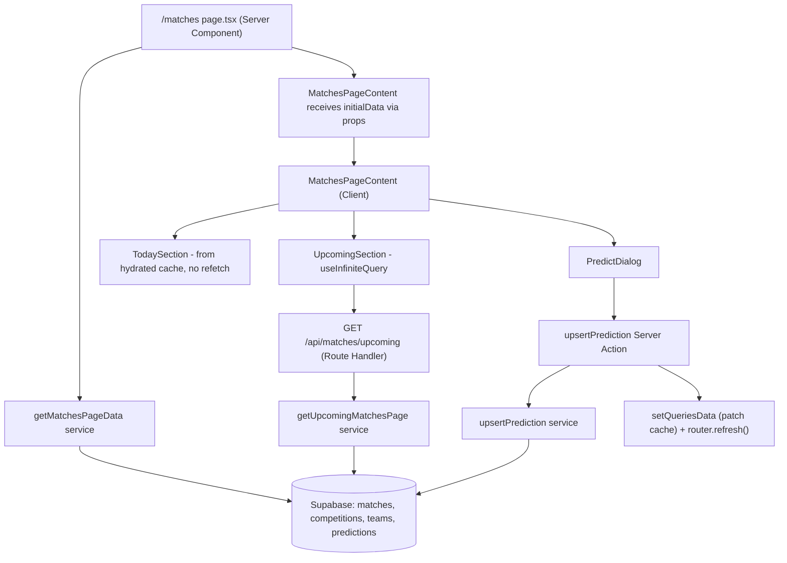

# Matches Feature Design

**Spec**: `.specs/features/matches/spec.md`
**Status**: Draft

---

## Architecture Overview

`/matches` is an async Server Component that fetches today's matches (full) and the first page of upcoming matches (grouped by competition, joined against the current user's `predictions`), then passes that data as props to a Client Component tree, which seeds `useInfiniteQuery`'s cache via `initialData` (no `dehydrate`/`HydrationBoundary` — see Tech Decisions). The client tree renders both sections from that seeded data (no extra fetch on mount), and drives further "Próximos" pages via `useInfiniteQuery` against a Route Handler. Predicting/editing opens a Dialog whose submit calls a Server Action that upserts into `predictions`; on success it patches the cached "Próximos" prediction directly (`setQueriesData`) and calls `router.refresh()` so the server-rendered "Hoje" section picks up the change too.



---

## Code Reuse Analysis

### Existing Components to Leverage

| Component                                                                       | Location                                                                              | How to Use                                                                                                |
| ------------------------------------------------------------------------------- | ------------------------------------------------------------------------------------- | --------------------------------------------------------------------------------------------------------- |
| `Badge`, `Avatar`/`AvatarFallback`, `Card`/`CardHeader`/`CardContent`, `Button` | `components/ui/*`                                                                     | Same primitives as `features/dashboard/components/match-card.tsx`, extended with status/prediction badges |
| `Form`, `Input`, `Label` (react-hook-form + zod pattern)                        | `components/ui/form.tsx`, existing usage in `features/auth/components/login-form.tsx` | Reuse the same RHF+zod wiring for the predict form                                                        |
| `getCurrentFirebaseUid()`                                                       | `lib/auth/get-current-user.ts`                                                        | Resolve the logged-in user server-side, in both the page and the Server Action                            |
| `supabaseAdmin`                                                                 | `lib/supabase/admin.ts`                                                               | Same admin client used by dashboard/sports-sync services                                                  |
| `QueryProvider` (already mounted in `app/layout.tsx`)                           | `config/providers/query-provider.tsx`                                                 | No changes needed — already wraps the whole app                                                           |
| `QUERY_KEYS`                                                                    | `config/query-keys.ts`                                                                | Add `MATCHES: ["matches"]` (currently empty `{}`)                                                         |

### Existing Pattern to Diverge From

| Pattern                          | Where                                               | Why this feature differs                                                                                                                 |
| -------------------------------- | --------------------------------------------------- | ---------------------------------------------------------------------------------------------------------------------------------------- |
| `getUtcDayBounds()`              | `features/dashboard/services/get-dashboard-data.ts` | Known UTC/BRT bug ([context.md](context.md)) — Matches introduces `getBrazilDayBounds()` instead; dashboard is left as-is (out of scope) |
| `hasPrediction: false` hardcoded | same file                                           | Matches actually joins `predictions` filtered by `user_id`                                                                               |

### New shadcn Primitive Required

`Dialog` (`components/ui/dialog.tsx`) does not exist yet — add via `npx shadcn add dialog` before building `PredictDialog`. No other new UI primitives needed (`Input`, `Form`, `Label`, `Button` already exist).

### Integration Points

| System                                                       | Integration Method                                                                                                                                           |
| ------------------------------------------------------------ | ------------------------------------------------------------------------------------------------------------------------------------------------------------ |
| Supabase (`matches`, `competitions`, `teams`, `predictions`) | New `features/matches/services/**` using `supabaseAdmin`; requires new `eslint.config.mjs` override entry (see below)                                        |
| ESLint `no-restricted-imports`                               | Add `"features/matches/services/**/*.ts"` to the existing override block alongside `dashboard`/`sports-sync`                                                 |
| React Query                                                  | New `QUERY_KEYS.MATCHES` in `config/query-keys.ts`; client seeded via `initialData` prop (see Tech Decisions) rather than server dehydrate/HydrationBoundary |

---

## Components

### `app/(app)/matches/page.tsx`

- **Purpose**: Server entry point — fetch initial data, pass as props to seed the client tree
- **Location**: `app/(app)/matches/page.tsx` (replaces the placeholder)
- **Interfaces**: Next.js page component (no props; async function)
- **Dependencies**: `getMatchesPageData`, `getCurrentFirebaseUid`, `getUpcomingMatchesPage` result passed as a plain prop (no QueryClient/dehydrate on the server)
- **Reuses**: Route already exists as a placeholder; `AppShell`/layout unchanged

### `features/matches/services/get-matches-page-data.ts`

- **Purpose**: Fetch today's matches (full) + first page of upcoming matches (both grouped by competition), joined with the current user's predictions
- **Location**: `features/matches/services/get-matches-page-data.ts`
- **Interfaces**:
  - `getMatchesPageData(firebaseUid: string | null): Promise<{ todayGroups: MatchGroup[]; upcomingPage: UpcomingMatchesPage }>`
- **Dependencies**: `supabaseAdmin`, `getBrazilDayBounds`, `groupByCompetition`, `toMatchCardData`
- **Reuses**: Query shape/select pattern from `get-dashboard-data.ts`'s `MATCH_SELECT`, extended with `matches.status` and a `predictions` left join filtered by user

### `features/matches/services/get-upcoming-matches-page.ts`

- **Purpose**: Fetch one cursor-paginated page of upcoming matches (used by both the initial server fetch and the Route Handler for subsequent pages)
- **Location**: `features/matches/services/get-upcoming-matches-page.ts`
- **Interfaces**:
  - `getUpcomingMatchesPage(params: { firebaseUid: string | null; cursor: { matchDate: string; id: string } | null; limit: number }): Promise<UpcomingMatchesPage>`
- **Dependencies**: `supabaseAdmin`
- **Reuses**: Same select/mapping helpers as `get-matches-page-data.ts` (shared internal module, not duplicated)

### `features/matches/services/upsert-prediction.ts`

- **Purpose**: Upsert a `predictions` row for `(user_id, match_id)`, rejecting matches that are no longer `scheduled`
- **Location**: `features/matches/services/upsert-prediction.ts`
- **Interfaces**:
  - `upsertPrediction(input: { userId: string; matchId: string; predictedHomeScore: number; predictedAwayScore: number }): Promise<{ ok: true } | { ok: false; error: string }>`
- **Dependencies**: `supabaseAdmin`
- **Reuses**: Existing unique constraint `(user_id, match_id)` on `predictions` — `upsert(..., { onConflict: "user_id,match_id" })`

### `app/api/matches/upcoming/route.ts`

- **Purpose**: GET endpoint the client's `useInfiniteQuery` calls for pages 2+ of "Próximos"
- **Location**: `app/api/matches/upcoming/route.ts`
- **Interfaces**: `GET(request: Request)` — reads `cursorMatchDate`, `cursorId` query params, calls `getCurrentFirebaseUid()` + `getUpcomingMatchesPage`, returns `UpcomingMatchesPage` as JSON
- **Dependencies**: `getUpcomingMatchesPage`, `getCurrentFirebaseUid`
- **Reuses**: Same response shape as the server-fetched first page, so `useInfiniteQuery`'s `initialData` (from hydration) and subsequent pages are structurally identical

### `features/matches/actions/predictions.ts`

- **Purpose**: Server Action — the only mutation entry point; resolves the authenticated user and delegates to the service
- **Location**: `features/matches/actions/predictions.ts` (`"use server"`)
- **Interfaces**:
  - `submitPrediction(input: { matchId: string; predictedHomeScore: number; predictedAwayScore: number }): Promise<{ ok: true } | { ok: false; error: string }>`
- **Dependencies**: `getCurrentFirebaseUid`, a `users` lookup by `firebase_uid` (same pattern as `get-dashboard-data.ts`), `upsertPrediction` service
- **Reuses**: Auth resolution pattern already used in the dashboard service; this is a genuine Next.js Server Action (unlike `features/auth/actions/session-actions.ts`, which is a fetch wrapper only because the Firebase ID token exists client-side — here the session cookie is already readable server-side)

### `features/matches/components/matches-page-content.tsx`

- **Purpose**: Client root — renders Today/Upcoming sections, owns the open/selected-match state for `PredictDialog`
- **Location**: `features/matches/components/matches-page-content.tsx` (`"use client"`)
- **Interfaces**: `MatchesPageContent({ todayGroups }: { todayGroups: MatchGroup[] })`
- **Dependencies**: `useUpcomingMatches`, `PredictDialog`, `MatchGroupSection`
- **Reuses**: n/a (new)

### `features/matches/components/match-group-section.tsx`

- **Purpose**: Render one competition's header + its match cards (used by both Today and Upcoming)
- **Location**: `features/matches/components/match-group-section.tsx`
- **Interfaces**: `MatchGroupSection({ group, onPredict }: { group: MatchGroup; onPredict: (match: MatchCardData) => void })`
- **Reuses**: n/a (new)

### `features/matches/components/match-card.tsx`

- **Purpose**: Single match card — competition badge, teams, kickoff time (BRT), status badge, prediction-status badge, CTA
- **Location**: `features/matches/components/match-card.tsx`
- **Interfaces**: `MatchCard({ match, onPredict }: { match: MatchCardData; onPredict: (match: MatchCardData) => void })`
- **Dependencies**: `Card`, `Badge`, `Avatar`, `Button`
- **Reuses**: Layout/structure of `features/dashboard/components/match-card.tsx`, extended with the status-badge map and a live CTA (not `disabled`)

### `features/matches/components/predict-dialog.tsx`

- **Purpose**: Dialog with a score form; creates or edits a prediction
- **Location**: `features/matches/components/predict-dialog.tsx` (`"use client"`)
- **Interfaces**: `PredictDialog({ match, open, onOpenChange }: { match: MatchCardData | null; open: boolean; onOpenChange: (open: boolean) => void })`
- **Dependencies**: `Dialog` (new shadcn primitive), `Form`/`Input` (existing), `zod`, `useSubmitPrediction`
- **Reuses**: Same RHF + zod resolver wiring as `features/auth/components/login-form.tsx`

### Hooks

- `features/matches/hooks/use-upcoming-matches.ts` — `useUpcomingMatches(initialPage: UpcomingMatchesPage)`: wraps `useInfiniteQuery` with `initialData` seeded from the hydrated first page, `queryKey: [...QUERY_KEYS.MATCHES, "upcoming"]`, `getNextPageParam` reading `nextCursor`
- `features/matches/hooks/use-submit-prediction.ts` — `useSubmitPrediction()`: wraps `useMutation(submitPrediction)`, on success calls `queryClient.invalidateQueries({ queryKey: QUERY_KEYS.MATCHES })`

---

## Data Models

### `MatchCardData` (`features/matches/types/index.ts`)

```typescript
interface MatchCardData {
  id: string;
  competitionId: string;
  competitionName: string;
  matchDate: string; // ISO, UTC — formatted client-side in America/Sao_Paulo
  status: "scheduled" | "live" | "finished" | "postponed" | "cancelled";
  homeTeamName: string;
  homeTeamShort: string;
  awayTeamName: string;
  awayTeamShort: string;
  prediction: {
    id: string;
    predictedHomeScore: number;
    predictedAwayScore: number;
  } | null;
}

interface MatchGroup {
  competitionId: string;
  competitionName: string;
  matches: MatchCardData[];
}

interface UpcomingMatchesPage {
  groups: MatchGroup[];
  nextCursor: { matchDate: string; id: string } | null;
}
```

**Relationships**: Derived read model over `matches` (→ `competitions`, `teams` via FKs) left-joined with `predictions` filtered to the current `user_id`. No new tables or columns.

### Prediction status derivation (pure function, no new type)

`predictionStatusFor(match: MatchCardData): "no-prediction" | "predicted" | "locked"`

- `status !== "scheduled"` → `"locked"` (CTA disabled, badge per status map)
- `status === "scheduled" && prediction === null` → `"no-prediction"` (badge "Sem palpite", CTA "Predict")
- `status === "scheduled" && prediction !== null` → `"predicted"` (badge "Palpite feito", CTA "Editar palpite")

---

## Error Handling Strategy

| Error Scenario                                                                                        | Handling                                                                                                         | User Impact                                                                                                                         |
| ----------------------------------------------------------------------------------------------------- | ---------------------------------------------------------------------------------------------------------------- | ----------------------------------------------------------------------------------------------------------------------------------- |
| Supabase read fails in `page.tsx`                                                                     | Let it throw → caught by `app/(app)/matches/error.tsx` (new, minimal — "Não foi possível carregar as partidas.") | Page-level error boundary instead of a crash                                                                                        |
| `GET /api/matches/upcoming` fails                                                                     | Route Handler returns `500` with `{ error }`; `useInfiniteQuery` surfaces `isError`                              | "Load more" area shows a retry affordance                                                                                           |
| `submitPrediction` called for a non-`scheduled` match (race: match started between render and submit) | Service checks `matches.status` before upsert, returns `{ ok: false, error: "match already started" }`           | Dialog shows the error inline, does not close                                                                                       |
| `submitPrediction` called while unauthenticated (expired session)                                     | `getCurrentFirebaseUid()` returns `null` → action short-circuits `{ ok: false, error: "not authenticated" }`     | Dialog shows the error inline; CTA shouldn't normally be reachable unauthenticated since the whole `(app)` group requires a session |
| Invalid form input (negative/non-integer/empty score)                                                 | Client-side zod validation blocks submit before the Server Action is called                                      | Inline field error, no network call                                                                                                 |

---

## Tech Decisions (only non-obvious ones)

| Decision                                                              | Choice                                                                                                                                                             | Rationale                                                                                                                                                             |
| --------------------------------------------------------------------- | ------------------------------------------------------------------------------------------------------------------------------------------------------------------ | --------------------------------------------------------------------------------------------------------------------------------------------------------------------- |
| Client fetch path for pagination                                      | Route Handler (`GET /api/matches/upcoming`) rather than calling a Server Action from `queryFn`                                                                     | Matches this repo's existing convention of Route Handlers for reads (`app/api/sync/*`) and keeps `actions/**` reserved for mutations, per `CLAUDE.md`'s decision tree |
| Prediction mutation path                                              | Genuine Next.js Server Action (`"use server"`)                                                                                                                     | Unlike `session-actions.ts`, the session cookie is already server-readable here — no client-only token involved, so a real Server Action applies cleanly              |
| Day boundary calculation                                              | Fixed `America/Sao_Paulo` offset via `Intl.DateTimeFormat` date parts, not a full tz library                                                                       | Brazil has used a fixed UTC-3 offset (no DST) since 2019; no new dependency needed for this one calculation                                                           |
| Shared select/mapping logic between initial page and subsequent pages | One internal module (e.g. `features/matches/services/_shared.ts` or co-located helpers) used by both `get-matches-page-data.ts` and `get-upcoming-matches-page.ts` | Avoids duplicating the Supabase select string and row-mapping function; still two public entry points per their distinct callers (page vs Route Handler)              |
| `eslint.config.mjs` override                                          | Add `"features/matches/services/**/*.ts"` to the existing file-scoped override, not the base rule                                                                  | Follows the exact pattern already used for `dashboard`/`sports-sync`; keeps the restriction (client-side code can't import `supabaseAdmin`) intact everywhere else    |

---

## Open Items Carried from Spec

- `app/(app)/matches/error.tsx` is new (not in spec explicitly) but required by the Edge Case "Supabase read fails → page-level error state" — flag for `/taskify`.
- `Dialog` shadcn primitive must be added before `PredictDialog` can be built — flag as a setup step for `/taskify`.
