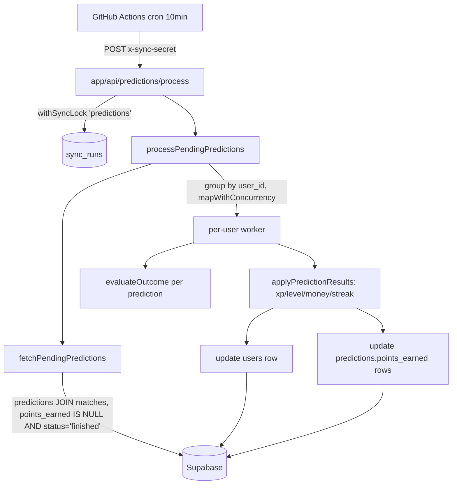

# PredictionProcessor Design

**Spec**: `.specs/features/prediction-processor/spec.md`
**Status**: Draft

---

## Architecture Overview

Novo bounded context `features/prediction-processing/` (paralelo a `features/sports-sync/`), disparado por uma rota HTTP protegida, reutilizando o mesmo mecanismo de lock (`sync_runs` + `withSyncLock`) já usado pela sincronização de partidas. O processor lê previsões pendentes (join `predictions` + `matches`), agrupa por usuário, e atualiza cada usuário de forma independente e concorrente (mesmo padrão de `mapWithConcurrency` de `features/sports-sync`).



---

## Code Reuse Analysis

### Existing Components to Leverage

| Component                                             | Location                                                                                 | How to Use                                                                                                       |
| ----------------------------------------------------- | ---------------------------------------------------------------------------------------- | ---------------------------------------------------------------------------------------------------------------- |
| `withSyncLock`, `SyncAlreadyRunningError`, `SyncType` | `features/sports-sync/services/sync-lock-service.ts`                                     | Reusar tal qual; estender `SyncType` para incluir `"predictions"`                                                |
| `mapWithConcurrency`, `DEFAULT_CONCURRENCY_LIMIT`     | `lib/concurrency.ts`                                                                     | Processar usuários em paralelo limitado, mesmo padrão de `finished-matches-sync-service.ts`                      |
| `isValidSyncSecret`                                   | `lib/sync-auth.ts`                                                                       | Autenticação da nova rota, idêntica às rotas `/api/sync/*`                                                       |
| `supabaseAdmin`                                       | `lib/supabase/admin.ts`                                                                  | Único client de acesso a dados (RLS deny-all para anon/authenticated)                                            |
| Padrão de rota                                        | `app/api/sync/finished/route.ts`                                                         | Template estrutural para `app/api/predictions/process/route.ts`                                                  |
| Padrão de limite + warning em backlog                 | `features/sports-sync/services/finished-matches-sync-service.ts` (`STUCK_MATCHES_LIMIT`) | Aplicar o mesmo padrão (`PENDING_PREDICTIONS_LIMIT`) para não buscar volume ilimitado                            |
| `getBrazilDayBounds` (lógica de fuso)                 | `features/matches/lib/get-brazil-day-bounds.ts`                                          | Generalizar a lógica de fuso (não a função em si) para um helper compartilhado — ver `lib/brazil-time.ts` abaixo |

### Integration Points

| System                                   | Integration Method                                                                                                                                                   |
| ---------------------------------------- | -------------------------------------------------------------------------------------------------------------------------------------------------------------------- |
| Cron GitHub Actions                      | Descomentar o step já existente (comentado como TODO) em `.github/workflows/live-sync.yml`, chamado logo após `Update finished matches`                              |
| Dashboard (`features/dashboard`)         | Nenhuma mudança de leitura necessária além de trocar a fórmula local por `lib/gamification.ts` (mesma saída, elimina duplicação/risco de divergência já documentado) |
| Criação de previsão (`features/matches`) | `submitPrediction` action e `upsertPrediction` service passam a aceitar `wagered_amount` opcional                                                                    |

---

## Components

### `lib/gamification.ts` (novo, compartilhado)

- **Purpose**: Fonte única da fórmula de XP/level, usada tanto na leitura (dashboard) quanto na escrita (processor) — resolve o risco de divergência já sinalizado em `.specs/features/dashboard/context.md`.
- **Location**: `lib/gamification.ts`
- **Interfaces**:
  - `XP_THRESHOLD: number` — `3000`
  - `levelForXp(xp: number): number` — `Math.floor(xp / XP_THRESHOLD) + 1`
  - `xpInLevelForXp(xp: number): number` — `xp % XP_THRESHOLD`
- **Dependencies**: nenhuma
- **Reuses**: extrai a fórmula hoje inline em `features/dashboard/services/get-dashboard-data.ts`

### `lib/brazil-time.ts` (novo, compartilhado)

- **Purpose**: Calcular o dia civil (fuso Brasil) de uma data arbitrária — necessário para o processor decidir se um novo dia de streak deve ser contado. A função existente (`getBrazilDayBounds`) só resolve "hoje", não uma data qualquer.
- **Location**: `lib/brazil-time.ts`
- **Interfaces**:
  - `getBrazilCalendarDay(date: Date): string` — retorna `YYYY-MM-DD` no fuso `America/Sao_Paulo` (offset fixo `-03:00`)
- **Dependencies**: nenhuma
- **Reuses**: generaliza a lógica de `todayInBrazil()` já existente em `features/matches/lib/get-brazil-day-bounds.ts` (que passa a poder ser reescrita sobre essa função, mantendo compatibilidade)

### `features/prediction-processing/` (novo feature)

```
features/prediction-processing/
├── lib/
│   └── evaluate-outcome.ts
├── services/
│   ├── fetch-pending-predictions.ts
│   ├── apply-prediction-results.ts
│   └── process-pending-predictions.ts
├── types/
│   └── index.ts
└── index.ts
```

#### `lib/evaluate-outcome.ts`

- **Purpose**: Função pura de domínio — deriva V/E/D e decide Win/Lose. Sem I/O, fácil de testar isoladamente.
- **Interfaces**:
  - `matchOutcome(homeScore: number, awayScore: number): "home" | "draw" | "away"`
  - `isWinningPrediction(predicted: { home: number; away: number }, actual: { home: number; away: number }): boolean`
- **Dependencies**: nenhuma

#### `services/fetch-pending-predictions.ts`

- **Purpose**: Busca previsões elegíveis (idempotência).
- **Interfaces**:
  - `fetchPendingPredictions(): Promise<PendingPrediction[]>`
- **Query**: `predictions` com `points_earned IS NULL`, join `matches!inner(status, home_score, away_score, match_date)` filtrando `matches.status = 'finished'`, limitado a `PENDING_PREDICTIONS_LIMIT = 500` (mesmo padrão de aviso de `finished-matches-sync-service.ts` se o limite for atingido)
- **Dependencies**: `supabaseAdmin`

#### `services/apply-prediction-results.ts`

- **Purpose**: Dado o estado atual de um usuário e suas previsões pendentes (já ordenadas cronologicamente por `match_date`), calcula o novo estado do usuário e o resultado (`points_earned`) de cada previsão. Função pura — não toca no banco.
- **Interfaces**:
  - `applyPredictionResults(user: UserGamificationState, predictions: PendingPrediction[]): { userUpdate: UserGamificationState; predictionResults: { id: string; pointsEarned: 0 | 1 }[] }`
- **Lógica**:
  1. Para cada previsão (em ordem cronológica): calcula `isWin` via `isWinningPrediction`; `pointsEarned = isWin ? 1 : 0`
  2. `xpDelta += isWin ? 100 : 0`
  3. `moneyDelta += prediction.wageredAmount ?? 10`
  4. `dayCivil = getBrazilCalendarDay(prediction.matchDate)`; se `dayCivil !== lastStreakDate` corrente: `streak += 1`, `lastStreakDate = dayCivil`
  5. Ao final: `newXp = user.xp + xpDelta`; `level = levelForXp(newXp)` (via `lib/gamification.ts`)
- **Dependencies**: `lib/gamification.ts`, `lib/brazil-time.ts`, `evaluate-outcome.ts`

#### `services/process-pending-predictions.ts`

- **Purpose**: Orquestrador — ponto de entrada do feature, chamado pela rota.
- **Interfaces**:
  - `processPendingPredictions(): Promise<{ usersUpdated: number; predictionsProcessed: number }>`
- **Lógica**:
  1. `fetchPendingPredictions()`
  2. Agrupa por `userId`, ordena cada grupo por `matchDate` ascendente
  3. `mapWithConcurrency(userGroups, DEFAULT_CONCURRENCY_LIMIT, processUserGroup)`, onde `processUserGroup`:
     - Busca a linha atual de `users` (`id, xp, money_saved, current_streak, last_streak_date`)
     - `applyPredictionResults(...)`
     - `update users` com os novos valores (`xp`, `level`, `money_saved`, `current_streak`, `last_streak_date`)
     - `update predictions` (uma chamada por previsão, `.update({ points_earned }).eq("id", predictionId)`, mesmo padrão pontual de `update-match-row.ts`) — escrita por usuário isolada, então falha em um usuário não afeta os demais (edge case do spec: "processar cada previsão... independentemente")
- **Dependencies**: `fetch-pending-predictions.ts`, `apply-prediction-results.ts`, `lib/concurrency.ts`, `supabaseAdmin`

### `app/api/predictions/process/route.ts`

- **Purpose**: Entry point HTTP, mesmo template de `app/api/sync/finished/route.ts`.
- **Interfaces**: `POST(request: Request): Promise<NextResponse>`
- **Lógica**: valida `x-sync-secret` (401 se inválido) → `withSyncLock("predictions", () => processPendingPredictions())` (importado de `@/features/sports-sync`) → 200 com resultado; `SyncAlreadyRunningError` → 409; outro erro → 500
- **Dependencies**: `@/features/sports-sync` (lock), `@/features/prediction-processing` (serviço), `@/lib/env`, `@/lib/sync-auth`

---

## Data Models

### `predictions` (alteração)

```sql
ALTER TABLE predictions
  ADD COLUMN wagered_amount NUMERIC(10,2) CHECK (wagered_amount > 0);
```

- Nullable, sem default — ausência de valor é o caso normal (fallback de R$10 é aplicado em memória pelo processor, não no banco).

### `users` (alteração)

```sql
ALTER TABLE users
  ADD COLUMN last_streak_date DATE;
```

- Nullable — `NULL` significa "nunca processado", primeira previsão processada sempre incrementa o streak.

### `sync_runs` (alteração de constraint)

```sql
ALTER TABLE sync_runs DROP CONSTRAINT sync_runs_type_check;
ALTER TABLE sync_runs ADD CONSTRAINT sync_runs_type_check
  CHECK (type IN ('competitions', 'teams', 'matches', 'live', 'finished', 'predictions'));
```

- **Atenção na implementação**: confirmar o nome exato da constraint gerada (`\d sync_runs` ou `pg_constraint`) antes de aplicar o `DROP CONSTRAINT` — nome assumido pelo padrão de nomeação do Postgres (`<tabela>_<coluna>_check`), não foi nomeado explicitamente na migration original.

### Tipos TypeScript (`features/prediction-processing/types/index.ts`)

```typescript
export interface PendingPrediction {
  id: string;
  userId: string;
  matchDate: string; // ISO
  predictedHomeScore: number;
  predictedAwayScore: number;
  homeScore: number;
  awayScore: number;
  wageredAmount: number | null;
}

export interface UserGamificationState {
  xp: number;
  level: number;
  moneySaved: number;
  currentStreak: number;
  lastStreakDate: string | null; // YYYY-MM-DD
}
```

**Relationships**: `PendingPrediction.userId` → `users.id`; agrupamento em memória, sem nova tabela de relação.

---

## Error Handling Strategy

| Error Scenario                                                     | Handling                                                                                                                                                                     | User Impact                                                                                          |
| ------------------------------------------------------------------ | ---------------------------------------------------------------------------------------------------------------------------------------------------------------------------- | ---------------------------------------------------------------------------------------------------- |
| `x-sync-secret` ausente/inválido                                   | Retorna 401 antes de qualquer leitura                                                                                                                                        | Nenhum (chamada não autorizada rejeitada)                                                            |
| Execução concorrente (`sync_runs` já `running` para `predictions`) | `withSyncLock` propaga `SyncAlreadyRunningError` → rota retorna 409                                                                                                          | Cron seguinte tenta de novo em 10 min                                                                |
| Erro de leitura/escrita Supabase em um usuário específico          | `mapWithConcurrency` não tem isolamento de erro built-in — encapsular cada worker em try/catch, logar e continuar os demais usuários; erro isolado não derruba o run inteiro | Usuário afetado é reprocessado no próximo run (previsões dele continuam com `points_earned IS NULL`) |
| Erro na busca inicial (`fetchPendingPredictions`)                  | Propaga, `withSyncLock` marca run como `failed`, rota retorna 500                                                                                                            | Cron seguinte tenta o run inteiro de novo                                                            |
| Backlog de previsões pendentes atinge `PENDING_PREDICTIONS_LIMIT`  | `console.warn`, processa só o lote atual (mesmo padrão de `STUCK_MATCHES_LIMIT`)                                                                                             | Restante processado nos runs seguintes (a cada 10 min)                                               |

---

## Tech Decisions (only non-obvious ones)

| Decision                                                                      | Choice                                                                                                                  | Rationale                                                                                                                                                                                                                           |
| ----------------------------------------------------------------------------- | ----------------------------------------------------------------------------------------------------------------------- | ----------------------------------------------------------------------------------------------------------------------------------------------------------------------------------------------------------------------------------- |
| Onde vive a lógica de processamento                                           | Feature nova `features/prediction-processing/`, não dentro de `features/matches/`                                       | Domain First: é uma responsabilidade de batch/gamificação distinta de "navegar/apostar em partidas", espelha a separação já existente entre `features/matches` (escrita do palpite) e `features/sports-sync` (job de sincronização) |
| Reuso do lock de sync                                                         | Estender `SyncType` em `features/sports-sync/services/sync-lock-service.ts` com `"predictions"` em vez de duplicar lock | Mesma tabela `sync_runs`, mesmo mecanismo — decisão explícita da interview de seguir o padrão de sports-sync; evita duplicar lógica de lock                                                                                         |
| Fórmula de XP/level centralizada                                              | Novo `lib/gamification.ts`, dashboard refatorado para importar de lá                                                    | Elimina duplicação da fórmula (`floor(xp/3000)+1`) entre leitura e escrita — resolve risco de divergência já documentado em `.specs/features/dashboard/context.md`                                                                  |
| Escrita por usuário, não em lote único                                        | Cada usuário processado e persistido independentemente (`mapWithConcurrency`)                                           | Falha em um usuário não deve bloquear os demais; alinhado ao edge case do spec                                                                                                                                                      |
| Fallback de `wagered_amount` aplicado em memória, não como `DEFAULT` no banco | Coluna sem `DEFAULT`; fallback R$10 no cálculo (`apply-prediction-results.ts`)                                          | Decisão explícita da interview — banco reflete só o que o usuário informou; regra de negócio fica no código, não escondida no schema                                                                                                |

---

## Next Step

Escopo é multi-componente (nova feature, 3 migrations, refatoração de dashboard, rota nova, integração de cron) — segue o mapeamento de auto-sizing para escopo **Large**: próximo passo é `/taskify` para quebrar em tarefas atômicas com dependências antes de `/execute`.
