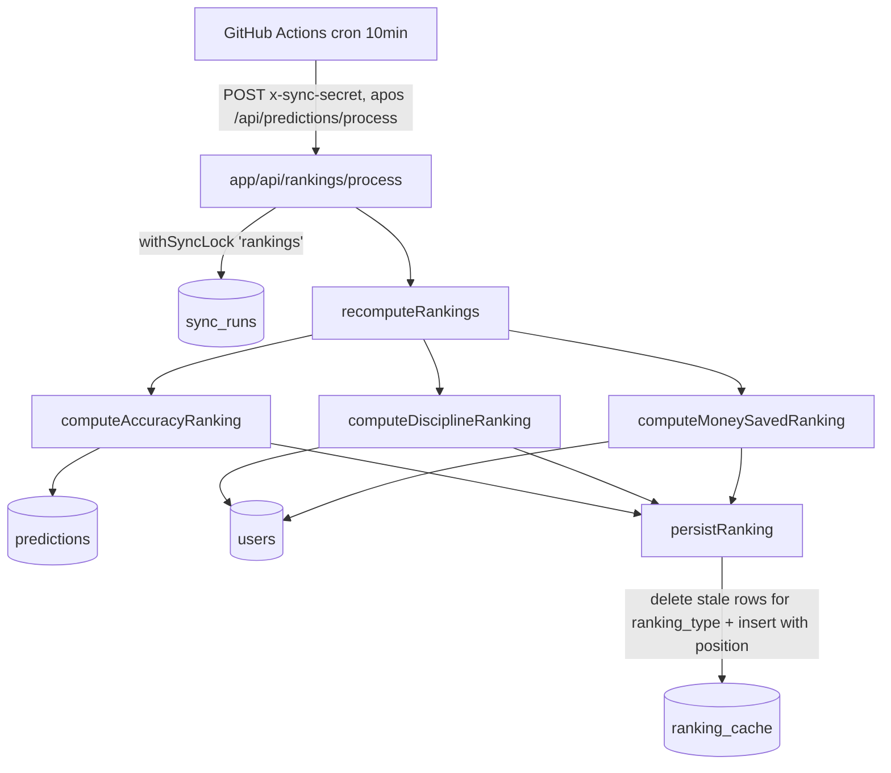

# Ranking Engine Design

**Spec**: `.specs/features/ranking-engine/spec.md`
**Status**: Draft

---

## Architecture Overview

Nova feature `features/ranking-engine/` (paralela a `features/prediction-processing/`), disparada por rota HTTP protegida, reutilizando o mesmo `withSyncLock`/`sync_runs`. Cada execução recalcula os 3 rankings do zero: computa a lista ordenada de usuários elegíveis por ranking, e substitui as linhas correspondentes em `ranking_cache` (delete-then-insert por `ranking_type`, escopo geral).



---

## Code Reuse Analysis

### Existing Components to Leverage

| Component                                             | Location                                                                 | How to Use                                                                                                                                                                 |
| ----------------------------------------------------- | ------------------------------------------------------------------------ | -------------------------------------------------------------------------------------------------------------------------------------------------------------------------- |
| `withSyncLock`, `SyncAlreadyRunningError`, `SyncType` | `features/sports-sync/services/sync-lock-service.ts`                     | Reusar tal qual; estender `SyncType` para incluir `"rankings"`                                                                                                             |
| `isValidSyncSecret`                                   | `lib/sync-auth.ts`                                                       | Autenticação da nova rota, idêntica a `/api/predictions/process`                                                                                                           |
| `supabaseAdmin`                                       | `lib/supabase/admin.ts`                                                  | Único client de acesso a dados                                                                                                                                             |
| Padrão de rota                                        | `app/api/predictions/process/route.ts`                                   | Template estrutural para `app/api/rankings/process/route.ts`                                                                                                               |
| Padrão de orquestrador + isolamento de erro           | `features/prediction-processing/services/process-pending-predictions.ts` | Estrutura de referência (não há necessidade de `mapWithConcurrency` aqui — os 3 rankings são independentes entre si e cada um é um cálculo em lote único, não por-usuário) |

### Integration Points

| System              | Integration Method                                                                                                                                                                          |
| ------------------- | ------------------------------------------------------------------------------------------------------------------------------------------------------------------------------------------- |
| Cron GitHub Actions | Novo step em `.github/workflows/live-sync.yml`, logo após `Trigger prediction processing` (dependência lógica: rankings leem `points_earned`/`money_saved`/`current_streak` já atualizados) |
| `ranking_cache`     | Escrita exclusiva desta feature — nenhuma outra feature escreve nessa tabela hoje                                                                                                           |

---

## Components

### `features/ranking-engine/types/index.ts`

- **Purpose**: Tipo de retorno comum dos 3 cálculos de ranking.
- **Interfaces**:
  ```typescript
  export interface RankedUser {
    userId: string;
    points: number; // ver encoding por ranking_type na seção Data Models
  }
  ```

### `features/ranking-engine/services/compute-accuracy-ranking.ts`

- **Purpose**: Calcula o ranking de Accuracy, aplicando o mínimo de elegibilidade.
- **Interfaces**: `computeAccuracyRanking(): Promise<RankedUser[]>`
- **Lógica**:
  1. `MIN_PROCESSED_PREDICTIONS = 5` (const no topo do arquivo)
  2. Busca todas as `predictions` com `points_earned IS NOT NULL` (`select("user_id, points_earned")`)
  3. Agrupa em memória por `user_id`: `total` (contagem), `correct` (soma de `points_earned`)
  4. Filtra usuários com `total >= MIN_PROCESSED_PREDICTIONS`
  5. `accuracy = correct / total`; `points = Math.round(accuracy * 10_000)` (basis points — 2 casas decimais de precisão percentual, ver Data Models)
  6. Ordena por `points` desc, `userId` asc (desempate determinístico)
- **Dependencies**: `supabaseAdmin`

### `features/ranking-engine/services/compute-discipline-ranking.ts`

- **Purpose**: Calcula o ranking de Discipline.
- **Interfaces**: `computeDisciplineRanking(): Promise<RankedUser[]>`
- **Lógica**: `supabaseAdmin.from("users").select("id, current_streak").order("current_streak", { ascending: false }).order("id", { ascending: true })` → mapeia para `{ userId: id, points: current_streak }`. Todos os usuários incluídos, sem filtro.
- **Dependencies**: `supabaseAdmin`

### `features/ranking-engine/services/compute-money-saved-ranking.ts`

- **Purpose**: Calcula o ranking de Money Saved.
- **Interfaces**: `computeMoneySavedRanking(): Promise<RankedUser[]>`
- **Lógica**: `supabaseAdmin.from("users").select("id, money_saved").order("money_saved", { ascending: false }).order("id", { ascending: true })` → `points = Math.round(money_saved * 100)` (centavos — ver Data Models). Todos os usuários incluídos, sem filtro.
- **Dependencies**: `supabaseAdmin`

### `features/ranking-engine/services/persist-ranking.ts`

- **Purpose**: Substitui as linhas de um `ranking_type` específico (escopo geral) por um novo conjunto ordenado, atribuindo `position` sequencial.
- **Interfaces**: `persistRanking(rankingType: "accuracy" | "discipline" | "money_saved", rankedUsers: RankedUser[]): Promise<number>` — retorna quantidade de linhas gravadas
- **Lógica**:
  1. `DELETE FROM ranking_cache WHERE ranking_type = $1 AND competition_id IS NULL` (`supabaseAdmin.from("ranking_cache").delete().eq("ranking_type", rankingType).is("competition_id", null)`)
  2. Se `rankedUsers` não vazio: `INSERT` em lote, `position = index + 1` (1-based, sequencial, sem empate compartilhado — desempate já resolvido na ordenação)
  3. Se `rankedUsers` vazio: só o delete, sem insert (nenhum erro)
- **Dependencies**: `supabaseAdmin`
- **Rationale do delete-then-insert**: full recompute decidido na interview; mais simples que diff incremental, e garante que usuários que deixaram de ser elegíveis (ex: caíram abaixo do mínimo de accuracy — teoricamente impossível hoje já que `points_earned` nunca é revertido, mas o código não deve depender dessa garantia) não fiquem com posição obsoleta.

### `features/ranking-engine/services/recompute-rankings.ts`

- **Purpose**: Orquestrador — ponto de entrada do feature.
- **Interfaces**: `recomputeRankings(): Promise<{ accuracyRanked: number; disciplineRanked: number; moneySavedRanked: number }>`
- **Lógica**: computa e persiste os 3 rankings sequencialmente (independentes entre si, volume esperado baixo — não há necessidade de `mapWithConcurrency`, cada ranking já é um único lote de leitura + um único lote de escrita, não uma coleção de itens processados individualmente como em `prediction-processing`):
  ```
  const accuracy = await persistRanking("accuracy", await computeAccuracyRanking());
  const discipline = await persistRanking("discipline", await computeDisciplineRanking());
  const moneySaved = await persistRanking("money_saved", await computeMoneySavedRanking());
  return { accuracyRanked: accuracy, disciplineRanked: discipline, moneySavedRanked: moneySaved };
  ```
- **Dependencies**: os 3 `compute-*` + `persist-ranking`

### `app/api/rankings/process/route.ts`

- **Purpose**: Entry point HTTP, mesmo template de `app/api/predictions/process/route.ts`.
- **Lógica**: valida `x-sync-secret` (401 se inválido) → `withSyncLock("rankings", () => recomputeRankings())` → 200 com resultado; `SyncAlreadyRunningError` → 409; outro erro → 500
- **Dependencies**: `@/features/sports-sync` (lock), `@/features/ranking-engine` (serviço), `@/lib/env`, `@/lib/sync-auth`

---

## Data Models

### `ranking_cache` (alteração)

```sql
ALTER TABLE ranking_cache ADD COLUMN ranking_type TEXT
  CHECK (ranking_type IN ('accuracy', 'discipline', 'money_saved'));

-- Backfill não é necessário: a tabela nunca foi populada (nenhum código escreveu nela até hoje).
UPDATE ranking_cache SET ranking_type = 'accuracy' WHERE ranking_type IS NULL; -- no-op de segurança, tabela vazia
ALTER TABLE ranking_cache ALTER COLUMN ranking_type SET NOT NULL;

ALTER TABLE ranking_cache DROP CONSTRAINT ranking_cache_user_id_competition_id_key; -- nome default da UNIQUE original
ALTER TABLE ranking_cache ADD CONSTRAINT ranking_cache_user_competition_type_key
  UNIQUE (user_id, competition_id, ranking_type);

DROP INDEX ranking_cache_general_unique;
CREATE UNIQUE INDEX ranking_cache_general_unique
  ON ranking_cache (user_id, ranking_type)
  WHERE competition_id IS NULL;

DROP INDEX ranking_cache_competition_points_idx;
CREATE INDEX ranking_cache_competition_points_idx
  ON ranking_cache (competition_id, ranking_type, points DESC);
```

- **Atenção na implementação**: confirmar o nome exato da constraint UNIQUE original (`ranking_cache_user_id_competition_id_key` é o padrão de nomeação do Postgres para `UNIQUE(user_id, competition_id)` sem nome explícito) antes do `DROP CONSTRAINT` — mesmo cuidado já aplicado na migration 15 para `sync_runs_type_check`.

### `sync_runs` (alteração de constraint)

```sql
ALTER TABLE sync_runs DROP CONSTRAINT IF EXISTS sync_runs_type_check;
ALTER TABLE sync_runs ADD CONSTRAINT sync_runs_type_check
  CHECK (type IN ('competitions', 'teams', 'matches', 'live', 'finished', 'predictions', 'rankings'));
```

### Encoding de `points` por `ranking_type`

A coluna `points` é `INTEGER`, mas cada ranking tem uma métrica de origem com tipo diferente. Convenção (documentada aqui para qualquer consumidor futuro, ex: UI):

| `ranking_type` | Métrica de origem                   | Encoding em `points`                                                |
| -------------- | ----------------------------------- | ------------------------------------------------------------------- |
| `accuracy`     | `acertos / processadas` (0–1)       | Basis points: `Math.round(accuracy * 10_000)` (ex: 92.34% → `9234`) |
| `discipline`   | `users.current_streak` (INTEGER)    | Valor direto, sem conversão                                         |
| `money_saved`  | `users.money_saved` (NUMERIC(10,2)) | Centavos: `Math.round(money_saved * 100)`                           |

### Tipos TypeScript (`features/ranking-engine/types/index.ts`)

```typescript
export interface RankedUser {
  userId: string;
  points: number;
}

export type RankingType = "accuracy" | "discipline" | "money_saved";
```

**Relationships**: `RankedUser.userId` → `users.id`; sem nova tabela de relação, `ranking_cache` já modela isso.

---

## Error Handling Strategy

| Error Scenario                                                  | Handling                                                                                                                | User Impact                                                                            |
| --------------------------------------------------------------- | ----------------------------------------------------------------------------------------------------------------------- | -------------------------------------------------------------------------------------- |
| `x-sync-secret` ausente/inválido                                | Retorna 401 antes de qualquer leitura                                                                                   | Nenhum                                                                                 |
| Execução concorrente (`sync_runs` já `running` para `rankings`) | `withSyncLock` propaga `SyncAlreadyRunningError` → rota retorna 409                                                     | Cron seguinte tenta de novo em 10 min                                                  |
| Erro em qualquer `compute-*-ranking` ou `persistRanking`        | Propaga sem captura local — `recomputeRankings` falha inteiro, `withSyncLock` marca run como `failed`, rota retorna 500 | Cron tenta o run inteiro de novo (idempotente: delete-then-insert é seguro de repetir) |
| Nenhum usuário elegível para um ranking                         | `persistRanking` só executa o delete, retorna 0, sem erro                                                               | Ranking fica vazio no cache até haver elegíveis                                        |

**Nota**: diferente do `prediction-processing` (que isola erro por usuário via try/catch em `mapWithConcurrency`), aqui não há necessidade de isolamento por item — cada ranking é uma operação em lote única, e delete-then-insert já é idempotente/seguro de reexecutar do zero em caso de falha parcial.

---

## Tech Decisions (only non-obvious ones)

| Decision                                                          | Choice                                                                              | Rationale                                                                                                                                                                                                                                                        |
| ----------------------------------------------------------------- | ----------------------------------------------------------------------------------- | ---------------------------------------------------------------------------------------------------------------------------------------------------------------------------------------------------------------------------------------------------------------- |
| Onde vive a lógica                                                | Feature nova `features/ranking-engine/`, não dentro de `prediction-processing`      | Domain First: cálculo de ranking é uma responsabilidade distinta (agregação read-heavy, sem escrita em `predictions`/`users`), espelha a separação já existente entre `prediction-processing` e `sports-sync`                                                    |
| Cálculo de accuracy em memória (JS) em vez de função SQL agregada | Fetch de `predictions` filtradas + agregação em JS                                  | Consistente com o estilo do resto do código (lógica de negócio em TypeScript, não em funções Postgres — única exceção existente é o lock de `acquire_sync_lock`, que é infraestrutura, não regra de negócio). Sem dado de volume que justifique otimização agora |
| Delete-then-insert em vez de upsert com diff                      | `persistRanking` sempre apaga as linhas do `ranking_type` e reinsere                | Full recompute decidido na interview; mais simples e correto por construção — não precisa calcular quais linhas remover                                                                                                                                          |
| Encoding de `points` como inteiro normalizado por tipo            | Basis points para accuracy, centavos para money_saved, valor direto para discipline | Coluna `points` é `INTEGER` (schema já existente, não alterado); preserva precisão sem exigir mudança de tipo de coluna                                                                                                                                          |
| Sem `mapWithConcurrency` neste feature                            | Cada ranking é processado como lote único sequencial                                | Ao contrário de `prediction-processing` (N usuários = N operações independentes), aqui há sempre exatamente 3 operações (uma por ranking) — paralelismo não traria ganho relevante                                                                               |

---

## Next Step

Escopo multi-componente (2 migrations, nova feature, rota nova, integração de cron) — segue auto-sizing para escopo **Large**: próximo passo é `/taskify` para quebrar em tarefas atômicas antes de `/execute`.
