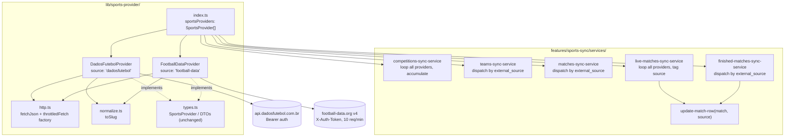
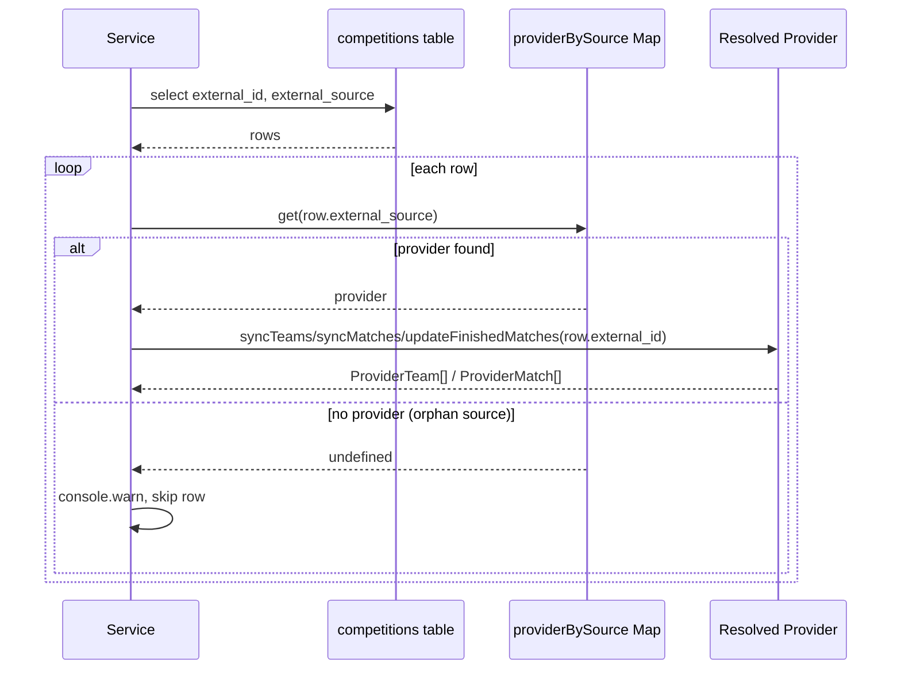

# Sports Provider Swap (Multi-Provider) Design

**Spec**: `.specs/features/sports-provider-swap/spec.md`
**Context**: `.specs/features/sports-provider-swap/context.md`
**Status**: Draft

---

## Architecture Overview

`TheSportsDBProvider` is deleted. Two new providers implement `SportsProvider`
independently and are composed as an array at the composition root. Services
either broadcast to every provider (global operations) or dispatch to the one
provider matching a competition row's `external_source` (per-competition
operations).



**Dispatch flow for per-competition services** (teams, matches, finished):



---

## Code Reuse Analysis

### Existing Components to Leverage

| Component                                                 | Location                                                                      | How to Use                                                           |
| --------------------------------------------------------- | ----------------------------------------------------------------------------- | -------------------------------------------------------------------- |
| `SportsProvider` interface                                | `lib/sports-provider/types.ts`                                                | Unchanged — both new providers implement it as-is                    |
| `ProviderCompetition`/`ProviderTeam`/`ProviderMatch` DTOs | `lib/sports-provider/types.ts`                                                | Unchanged — normalization target for both providers                  |
| `SportsProviderError`                                     | `lib/sports-provider/types.ts`                                                | Reused by the shared `http.ts` fetch helper and both providers       |
| `mapWithConcurrency` / `DEFAULT_CONCURRENCY_LIMIT`        | `lib/concurrency.ts`                                                          | Unchanged — services keep using it for per-competition fan-out       |
| `withSyncLock` / `MatchSyncService`                       | `features/sports-sync/services/sync-lock-service.ts`, `match-sync-service.ts` | Unchanged — provider-agnostic orchestration layer, no changes needed |
| `env` (`createEnv`)                                       | `lib/env.ts`                                                                  | Modified: remove 2 old vars, add 4 new (see Data Models)             |

### What Is NOT Reused From `TheSportsDBProvider`

| thesportsdb-provider.ts helper                         | Why it doesn't carry over                                                                                                                                                                                                                                                             |
| ------------------------------------------------------ | ------------------------------------------------------------------------------------------------------------------------------------------------------------------------------------------------------------------------------------------------------------------------------------- |
| `fetchJson(url)` (unauthenticated URL, no headers)     | Both new providers need custom headers (`Authorization: Bearer` / `X-Auth-Token`) — replaced by a shared, header-aware `fetchJson(url, headers)` in `lib/sports-provider/http.ts`                                                                                                     |
| `toISODateTime(dateEvent, strTime)`                    | thesportsdb split date+time into 2 fields; both new APIs return a single already-ISO8601 datetime string (`data_hora_realizacao`, `utcDate`) — no combining logic needed                                                                                                              |
| `toProviderNumber(raw: string \| null)`                | thesportsdb returned scores as strings; both new APIs return scores as native JSON integers/null — no string-to-number coercion needed                                                                                                                                                |
| Slug-based team lookup (`search_all_teams.php?l=slug`) | thesportsdb-specific quirk introduced in a prior change; neither new API supports team lookup by slug — `syncTeams` reverts to taking `externalCompetitionId` (numeric/code id), and `teams-sync-service.ts` reverts to selecting `external_id` instead of `slug` from `competitions` |

### Integration Points

| System                                        | Integration Method                                                                        |
| --------------------------------------------- | ----------------------------------------------------------------------------------------- |
| api.dadosfutebol.com.br                       | `DadosFutebolProvider` — REST + Bearer token, via shared `fetchJson`                      |
| football-data.org (v4)                        | `FootballDataProvider` — REST + `X-Auth-Token`, via shared `fetchJson` + `throttledFetch` |
| Supabase (`competitions`, `teams`, `matches`) | Unchanged upsert pattern in services, keyed on `(external_source, external_id)`           |

---

## Interface Correction (carried into this design)

Earlier in this workstream, `SportsProvider.syncTeams` was temporarily changed
to `syncTeams(competitionSlug: string)` to match a thesportsdb-specific
endpoint (`search_all_teams.php?l={slug}`). Since `TheSportsDBProvider` is
being removed entirely and neither `DadosFutebolProvider` nor
`FootballDataProvider` supports team lookup by slug, this design **reverts**
that parameter back to `externalCompetitionId: string` (the numeric/code id),
consistent with `syncMatches`/`updateFinishedMatches`. `teams-sync-service.ts`
reverts its `competitions` select from `slug` back to `external_id`.

---

## Components

### `lib/sports-provider/http.ts` (new)

- **Purpose**: Shared HTTP fetch + JSON parsing + error wrapping, reusable by any provider that needs custom headers (auth).
- **Location**: `lib/sports-provider/http.ts`
- **Interfaces**:
  - `fetchJson(url: string, headers?: HeadersInit): Promise<unknown>` — fetch, throw `SportsProviderError` on network failure, non-2xx, or JSON parse failure (same 3 failure modes `TheSportsDBProvider.fetchJson` had, generalized with headers)
  - `createThrottledFetchJson(minIntervalMs: number): (url: string, headers?: HeadersInit) => Promise<unknown>` — factory closing over a `lastRequestAt` timestamp; returns a `fetchJson`-compatible function that waits until `minIntervalMs` has elapsed since the previous call before firing
- **Dependencies**: none beyond native `fetch`
- **Reuses**: error-wrapping pattern from the deleted `thesportsdb-provider.ts`'s `fetchJson`

### `lib/sports-provider/normalize.ts` (new)

- **Purpose**: Shared name→slug normalization, used by both providers wherever the source API doesn't already provide a slug (football-data has no slug field at all; dadosfutebol has one for competitions but not for teams).
- **Location**: `lib/sports-provider/normalize.ts`
- **Interfaces**: `toSlug(name: string): string` (moved verbatim from `thesportsdb-provider.ts`)
- **Dependencies**: none

### `lib/sports-provider/dadosfutebol-provider.ts` (new)

- **Purpose**: `SportsProvider` implementation backed by `api.dadosfutebol.com.br`, covering Brasileirão Série A + Copa do Brasil.
- **Location**: `lib/sports-provider/dadosfutebol-provider.ts`
- **Interfaces** (implements `SportsProvider`):
  - `readonly source = "dadosfutebol"`
  - `syncCompetitions(): Promise<ProviderCompetition[]>` — 1 call per configured id: `GET /v1/campeonatos/:id`
  - `syncTeams(externalCompetitionId: string): Promise<ProviderTeam[]>` — paginated `GET /v1/campeonatos/:id/partidas`, teams deduplicated from `time_mandante`/`time_visitante`
  - `syncMatches(externalCompetitionId: string, _season: string): Promise<ProviderMatch[]>` — paginated `GET /v1/campeonatos/:id/partidas` (season param unused)
  - `updateLiveMatches(): Promise<ProviderMatch[]>` — `GET /v1/partidas/ao-vivo`, filtered to configured ids via nested `campeonato.id`
  - `updateFinishedMatches(externalCompetitionId: string): Promise<ProviderMatch[]>` — paginated `GET /v1/campeonatos/:id/partidas`, filtered to `status === "encerrado"`
  - private `fetchAllPages(path: string, params: URLSearchParams): Promise<unknown[]>` — loops `pagina`/`por_pagina=100` until `meta.pagina_atual >= meta.ultima_pagina`
- **Dependencies**: `env.DADOS_FUTEBOL_API_KEY`, `env.SPORTS_BR_LEAGUE_IDS`, `lib/sports-provider/http.ts`, `lib/sports-provider/normalize.ts`
- **Reuses**: `fetchJson` from `http.ts`, `toSlug` from `normalize.ts`, `SportsProviderError`, the "one call per configured id, accumulate" pattern already established

### `lib/sports-provider/football-data-provider.ts` (new)

- **Purpose**: `SportsProvider` implementation backed by `football-data.org` v4, covering Copa Libertadores + Copa Sudamericana.
- **Location**: `lib/sports-provider/football-data-provider.ts`
- **Interfaces** (implements `SportsProvider`):
  - `readonly source = "football-data"`
  - `syncCompetitions(): Promise<ProviderCompetition[]>` — 1 call per configured id: `GET /v4/competitions/:id`; `season` derived as `currentSeason.startDate.slice(0, 4)`
  - `syncTeams(externalCompetitionId: string): Promise<ProviderTeam[]>` — `GET /v4/competitions/:id/teams`
  - `syncMatches(externalCompetitionId: string, season: string): Promise<ProviderMatch[]>` — `GET /v4/competitions/:id/matches?season={season}` (season used, unlike DadosFutebolProvider)
  - `updateLiveMatches(): Promise<ProviderMatch[]>` — `GET /v4/matches?status=LIVE`, filtered to configured ids
  - `updateFinishedMatches(externalCompetitionId: string): Promise<ProviderMatch[]>` — `GET /v4/competitions/:id/matches?status=FINISHED`
  - private `throttledFetchJson` (bound instance of `createThrottledFetchJson(6500)`) — used by every method instead of raw `fetchJson`
- **Dependencies**: `env.FOOTBALL_DATA_API_KEY`, `env.SPORT_SA_LEAGUE_IDS`, `lib/sports-provider/http.ts`, `lib/sports-provider/normalize.ts`
- **Reuses**: `fetchJson`/`createThrottledFetchJson` from `http.ts`, `toSlug` from `normalize.ts`, `SportsProviderError`

### `lib/sports-provider/index.ts` (modified)

- **Purpose**: Composition root — the only place that instantiates concrete providers.
- **Interfaces**: `export const sportsProviders: SportsProvider[]`
- **Reuses**: replaces the single `sportsProvider` export; `DadosFutebolProvider`/`FootballDataProvider` instantiated with their respective env vars

### Sync services (modified)

| File                               | Change                                                                                                                                                                 |
| ---------------------------------- | ---------------------------------------------------------------------------------------------------------------------------------------------------------------------- |
| `competitions-sync-service.ts`     | Loop `sportsProviders`, call `syncCompetitions()` on each, tag rows with `provider.source`, accumulate into one upsert                                                 |
| `teams-sync-service.ts`            | Select `external_id, external_source` (revert from `slug`); dispatch per row via `providerBySource.get(external_source)`; skip + warn on unresolved source             |
| `matches-sync-service.ts`          | Select `external_id, external_source, season`; dispatch per row via `providerBySource`; skip + warn on unresolved source                                               |
| `finished-matches-sync-service.ts` | Query embeds `competitions(external_id, external_source)`; build unique `(external_source, external_id)` pairs; dispatch per pair; tag resulting matches with `source` |
| `live-matches-sync-service.ts`     | Loop `sportsProviders`, call `updateLiveMatches()` on each, pass `provider.source` into `updateMatchRow`                                                               |
| `update-match-row.ts`              | Signature becomes `updateMatchRow(match, source: string)`; `.eq("external_source", source)` instead of importing a singleton `sportsProvider.source`                   |

- **Reuses**: `mapWithConcurrency`, existing upsert/error-propagation patterns — no change to `MatchSyncService`/`withSyncLock`.

---

## Data Models

No new database tables/columns. `external_source` now takes 2 possible values
(`"dadosfutebol"`, `"football-data"`) instead of `"thesportsdb"` — no schema
change, just different data.

### `lib/env.ts` changes

```typescript
server: {
  // removed: SPORTS_PROVIDER_API_KEY, SPORTS_PROVIDER_LEAGUE_IDS
  DADOS_FUTEBOL_API_KEY: z.string().min(1),
  SPORTS_BR_LEAGUE_IDS: z.string().min(1),
  FOOTBALL_DATA_API_KEY: z.string().min(1),
  SPORT_SA_LEAGUE_IDS: z.string().min(1),
  SUPABASE_SERVICE_ROLE_KEY: z.string().min(1),
  SYNC_SECRET: z.string().min(1),
  // ...firebase vars unchanged
}
```

`.env.local` / `.env.example` mirror this, with placeholder league ids and a
`# TODO` comment per the Open Questions in `context.md`/`spec.md`.

---

## Error Handling Strategy

| Error Scenario                                                              | Handling                                                                 | User Impact                                                       |
| --------------------------------------------------------------------------- | ------------------------------------------------------------------------ | ----------------------------------------------------------------- |
| Network failure reaching either external API                                | `fetchJson` throws `SportsProviderError` immediately, no retry           | Sync run fails; cron/manual trigger retries next cycle            |
| Non-2xx HTTP response (incl. 429 rate limit)                                | Same as above — no special-casing for 429, throttling is preventive only | Same as above                                                     |
| Unmapped/unknown match status string from either API                        | Provider throws `SportsProviderError` at normalization time              | Sync run fails loudly instead of persisting a bad status          |
| `competitions` row with `external_source` matching no configured provider   | Service logs `console.warn` and skips that row, continues the rest       | Partial sync completes; orphaned competition simply isn't touched |
| `matches-sync-service` references a team not yet synced (existing behavior) | Unchanged — skip + warn, continue                                        | Unchanged                                                         |

---

## Tech Decisions

| Decision                                   | Choice                                                                 | Rationale                                                                                                     |
| ------------------------------------------ | ---------------------------------------------------------------------- | ------------------------------------------------------------------------------------------------------------- |
| Multi-provider composition                 | `sportsProviders: SportsProvider[]` array, services loop/dispatch      | Locked in `context.md` decision 1 — keeps `SportsProvider` interface untouched                                |
| Per-competition provider resolution        | `Map` from `provider.source` → `provider`, built once per service call | Locked in `context.md` decision 2 — O(1) lookup, no interface change                                          |
| Shared HTTP helper                         | Extract `fetchJson`/throttle factory to `lib/sports-provider/http.ts`  | Real duplication across 2 new providers (both need header-aware fetch + identical error wrapping) — DRY       |
| Shared slug helper                         | Extract `toSlug` to `lib/sports-provider/normalize.ts`                 | Both providers need it (football-data has no slug field at all); was private to the deleted thesportsdb file  |
| `syncTeams` parameter                      | Revert to `externalCompetitionId: string`                              | The slug-based variant was a thesportsdb-only quirk; neither new API supports slug-based team lookup          |
| FootballDataProvider throttling            | Per-instance `lastRequestAt` timestamp, 6.5s minimum interval          | Locked in `context.md` decision 5 — contained entirely inside the class, no shared/global rate limiter needed |
| Old data (`external_source='thesportsdb'`) | No migration                                                           | Locked in `context.md` decision 3 — no real production data to preserve                                       |

---

## Open Questions Carried Forward

See `context.md`/`spec.md` Open Questions — real league/competition ids,
dadosfutebol free-tier endpoint coverage, football-data CONMEBOL free-tier
coverage, and whether `/v4/competitions/:id/matches` paginates. None of these
block writing the code (placeholders + defensive handling cover them), but
they must be validated with real API keys before this ships to production.
