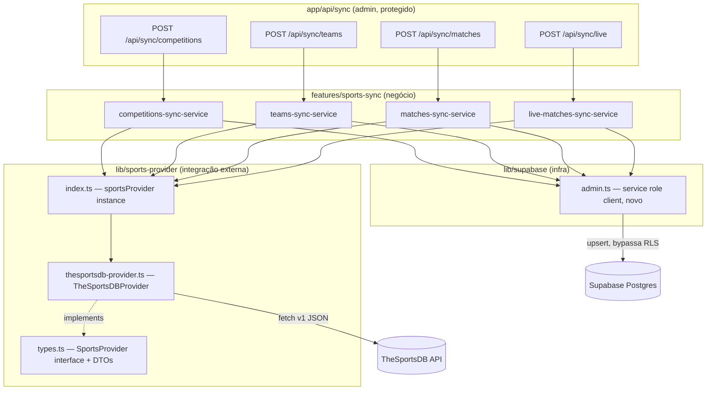

# Sports Provider Abstraction Design

**Spec**: `.specs/features/sports-provider/spec.md`
**Context**: `.specs/features/sports-provider/context.md`
**Status**: Draft

---

## Architecture Overview

`lib/sports-provider/` é uma camada de integração externa pura (mesma
categoria de `lib/firebase/`, `lib/supabase/`): define o contrato
`SportsProvider` e a implementação `TheSportsDBProvider`, sem nenhuma
dependência do Supabase. `features/sports-sync/services/` é a camada de
negócio que orquestra provider → normalização já feita pelo provider →
upsert no banco, usando um client Supabase **service role** (novo, server
-only) para escrever apesar do RLS `deny-all` já habilitado
(`database-schema/00000000000010_enable_rls.sql`). Route Handlers admin
expõem os services por HTTP, protegidas por header secreto.



**Regra de dependência (mandatória):** `features/sports-sync` pode importar
de `lib/sports-provider` e `lib/supabase`. `lib/sports-provider` NUNCA
importa nada de `features/*` ou de `lib/supabase` — não sabe que existe um
banco. Isso é o que garante "trocar provider sem tocar em lógica de
negócio": o provider não conhece a existência do Supabase.

---

## Code Reuse Analysis

### Existing Components to Leverage

| Component                              | Location                     | How to Use                                                              |
| ---------------------------------------- | ------------------------------- | ---------------------------------------------------------------------------- |
| Client module-level (import singleton) | `lib/supabase/client.ts`        | Mesmo padrão para o novo `lib/supabase/admin.ts` (client service-role) — `createClient` direto, sem guard `getApps()/getApp()`: esse guard é específico do Firebase SDK (registry global entre múltiplos "apps"), o Supabase JS client não tem esse problema, um `const` a nível de módulo já é suficiente |
| `env.ts` (`@t3-oss/env-nextjs`)          | `lib/env.ts`                    | Estender com novas vars server-only (`SUPABASE_SERVICE_ROLE_KEY`, `SPORTS_PROVIDER_API_KEY`, `SPORTS_PROVIDER_LEAGUE_IDS`, `SYNC_SECRET`) |
| Padrão de service como funções puras    | `features/auth/services/auth-service.ts` | Mesmo padrão para os 4 sync services — funções exportadas, não classes |
| Migrations numeradas sequenciais        | `supabase/migrations/`          | Nova migration `00000000000011_add_external_id_columns.sql`, seguindo a mesma convenção |
| Zod (já dependência do projeto)          | `zod` em `package.json`         | Validar a resposta da API do TheSportsDB antes de normalizar para DTO |

### Integration Points

| System                         | Integration Method                                                       |
| --------------------------------- | ------------------------------------------------------------------------------ |
| TheSportsDB API v1 (REST/JSON)  | `fetch` nativo dentro de `TheSportsDBProvider`, key na URL (`/api/v1/json/{key}/...`) |
| Supabase Postgres (service role) | Novo `lib/supabase/admin.ts`, usado só por `features/sports-sync/services/*` |
| Route Handlers Next.js          | `app/api/sync/*/route.ts`, runtime padrão (nodejs), método `POST`             |

---

## Components

### `lib/sports-provider/types.ts`

- **Purpose**: Define o contrato `SportsProvider` e os DTOs normalizados —
  o único arquivo que qualquer código fora de `lib/sports-provider/` precisa
  conhecer.
- **Interfaces**:
  ```typescript
  export type MatchStatus =
    | "scheduled"
    | "live"
    | "finished"
    | "postponed"
    | "cancelled";

  export interface ProviderCompetition {
    externalId: string;
    name: string;
    slug: string;
    season: string;
    logoUrl: string | null;
  }

  export interface ProviderTeam {
    externalId: string;
    name: string;
    slug: string;
    logoUrl: string | null;
  }

  export interface ProviderMatch {
    externalId: string;
    externalCompetitionId: string;
    externalHomeTeamId: string;
    externalAwayTeamId: string;
    matchDate: string; // ISO 8601
    round: string | null;
    status: MatchStatus;
    homeScore: number | null;
    awayScore: number | null;
  }

  export interface SportsProvider {
    syncCompetitions(): Promise<ProviderCompetition[]>;
    syncTeams(externalCompetitionId: string): Promise<ProviderTeam[]>;
    syncMatches(
      externalCompetitionId: string,
      season: string,
    ): Promise<ProviderMatch[]>;
    updateLiveMatches(): Promise<ProviderMatch[]>;
  }

  export class SportsProviderError extends Error {
    constructor(
      message: string,
      readonly cause?: unknown,
    ) {
      super(message);
      this.name = "SportsProviderError";
    }
  }
  ```
- **Dependencies**: nenhuma (tipos puros).

### `lib/sports-provider/thesportsdb-provider.ts`

- **Purpose**: Implementação concreta de `SportsProvider` contra a API v1
  do TheSportsDB (free tier).
- **Location**: `lib/sports-provider/thesportsdb-provider.ts`
- **Interfaces**: `export class TheSportsDBProvider implements SportsProvider`
- **Endpoints v1 usados** (base `https://www.thesportsdb.com/api/v1/json/{key}`):
  | Método                | Endpoint                                            | Confiança |
  | ----------------------- | ------------------------------------------------------ | --------- |
  | `syncCompetitions()`   | `GET /all_leagues.php`, filtrado pela lista configurada de league IDs | Alta — confirmado via docs oficiais |
  | `syncTeams(id)`        | `GET /lookup_all_teams.php?id={id}`                  | Média — nome exato do endpoint varia entre versões da doc; validar contra resposta real na implementação (ver Open Question no spec.md) |
  | `syncMatches(id, season)` | `GET /eventsseason.php?id={id}&s={season}`        | Alta — confirmado via docs oficiais |
  | `updateLiveMatches()`  | `GET /eventsday.php?d={hoje}&s=Soccer` por liga configurada, comparando `strStatus` | Baixa/aproximação — v1 não tem livescore real; ver `context.md` |
- **Mapeamento de status** (`strStatus` bruto → `MatchStatus`):
  - `"Not Started"` → `scheduled`
  - `"1H"`, `"2H"`, `"HT"`, `"ET"`, `"Live"` → `live`
  - `"Match Finished"`, `"FT"`, `"AET"`, `"Awarded"` → `finished`
  - `"Postponed"` → `postponed`
  - `"Cancelled"`, `"Abandoned"` → `cancelled`
  - Qualquer outro valor → lança `SportsProviderError` (spec SPORTS-01 AC4)
- **Dependencies**: `fetch` nativo, `zod` (schemas de resposta), `lib/env.ts`
  (API key, lista de league IDs).
- **Reuses**: nenhum client existente (é a primeira integração REST externa
  do projeto além de Firebase/Supabase SDKs).

### `lib/sports-provider/index.ts`

- **Purpose**: Factory/composition root — única instância exportada.
- **Interfaces**: `export const sportsProvider: SportsProvider`
- **Implementação**: `export const sportsProvider: SportsProvider = new TheSportsDBProvider(env.SPORTS_PROVIDER_API_KEY, env.SPORTS_PROVIDER_LEAGUE_IDS);`
- **Constraint**: nenhum outro arquivo do projeto importa `TheSportsDBProvider`
  diretamente — só `lib/sports-provider/index.ts` (enforced por convenção,
  revisável no `/review`).

### `lib/supabase/admin.ts` (novo, infra compartilhada)

- **Purpose**: Client Supabase com service role key, para escrita
  server-side que precisa bypassar RLS (`deny-all` habilitado em
  `database-schema/00000000000010_enable_rls.sql`).
- **Location**: `lib/supabase/admin.ts`
- **Interfaces**: `export const supabaseAdmin: SupabaseClient`
- **Dependencies**: `@supabase/supabase-js` (`createClient`), `lib/env.ts`
  (nova var server-only `SUPABASE_SERVICE_ROLE_KEY`).
- **Constraint**: só importado por `features/sports-sync/services/*` —
  nunca por código client-side (mesma disciplina de
  `lib/firebase/admin.ts`).
- **Nota**: RLS não se aplica ao service role, então este client sempre tem
  acesso total — é o único ponto de escrita para dados de sync.

### `features/sports-sync/services/competitions-sync-service.ts`

- **Purpose**: Orquestra `sportsProvider.syncCompetitions()` → upsert em
  `competitions`.
- **Interfaces**: `export async function syncCompetitions(): Promise<{ synced: number }>`
- **Dependencies**: `sportsProvider` (`lib/sports-provider`), `supabaseAdmin`
  (`lib/supabase/admin`).
- **Upsert**: `supabaseAdmin.from('competitions').upsert(rows, { onConflict: 'external_source,external_id' })`

### `features/sports-sync/services/teams-sync-service.ts`

- **Purpose**: Orquestra `sportsProvider.syncTeams(externalCompetitionId)`
  para cada competição já sincronizada → upsert em `teams`.
- **Interfaces**: `export async function syncTeams(): Promise<{ synced: number }>`
  — itera internamente sobre `competitions` já persistidas (lê
  `external_id` de cada uma via `supabaseAdmin`).

### `features/sports-sync/services/matches-sync-service.ts`

- **Purpose**: Orquestra `sportsProvider.syncMatches(externalCompetitionId, season)`
  para cada competição, resolve `home_team_id`/`away_team_id` via
  `external_id` de `teams` já sincronizados, faz upsert em `matches`.
- **Interfaces**: `export async function syncMatches(): Promise<{ synced: number; skipped: number }>`
- **Edge case (spec SPORTS-07 AC4)**: se um time referenciado não foi
  encontrado por `external_id`, incrementa `skipped` e continua (log de
  aviso, sem lançar erro).

### `features/sports-sync/services/live-matches-sync-service.ts`

- **Purpose**: Orquestra `sportsProvider.updateLiveMatches()` → `UPDATE`
  (nunca `INSERT`) em `matches` existentes, por `external_id`.
- **Interfaces**: `export async function updateLiveMatches(): Promise<{ updated: number; ignored: number }>`
- **Edge case (spec SPORTS-08 AC3)**: partida retornada pelo provider sem
  correspondência em `matches` por `external_id` → `ignored++`, sem criar
  linha nova.

### `app/api/sync/competitions/route.ts`, `.../teams/route.ts`, `.../matches/route.ts`, `.../live/route.ts`

- **Purpose**: Expor cada service via `POST`, protegido por header secreto.
- **Lógica comum** (repetida nas 4 rotas, sem abstração prematura — 4 rotas
  finas o suficiente para não justificar um wrapper genérico agora):
  ```
  if (request.headers.get('x-sync-secret') !== env.SYNC_SECRET) return 401
  try { const result = await <service>(); return Response.json(result, { status: 200 }) }
  catch { return new Response('Sync failed', { status: 500 }) }
  ```
- **Runtime**: `nodejs` (default para Route Handlers).

---

## Data Models

### Migration `supabase/migrations/00000000000011_add_external_id_columns.sql`

```sql
ALTER TABLE competitions ADD COLUMN external_id TEXT;
ALTER TABLE competitions ADD COLUMN external_source TEXT;
ALTER TABLE competitions ADD CONSTRAINT competitions_external_unique UNIQUE (external_source, external_id);

ALTER TABLE teams ADD COLUMN external_id TEXT;
ALTER TABLE teams ADD COLUMN external_source TEXT;
ALTER TABLE teams ADD CONSTRAINT teams_external_unique UNIQUE (external_source, external_id);

ALTER TABLE matches ADD COLUMN external_id TEXT;
ALTER TABLE matches ADD COLUMN external_source TEXT;
ALTER TABLE matches ADD CONSTRAINT matches_external_unique UNIQUE (external_source, external_id);
```

**Nota**: `NULL` em `(external_source, external_id)` não viola `UNIQUE`
(comportamento padrão Postgres — múltiplas linhas `NULL` coexistem), o que é
o comportamento desejado para registros criados manualmente sem origem
externa (spec SPORTS-04 AC3).

### `env.ts` — novas variáveis

```typescript
server: {
  // ...existentes (Firebase)
  SUPABASE_SERVICE_ROLE_KEY: z.string().min(1),
  SPORTS_PROVIDER_API_KEY: z.string().min(1), // "3" em dev (free tier)
  SPORTS_PROVIDER_LEAGUE_IDS: z.string().min(1), // CSV, ex: "4328,4335"
  SYNC_SECRET: z.string().min(1),
},
```

**Parsing de `SPORTS_PROVIDER_LEAGUE_IDS`**: `TheSportsDBProvider` faz
`.split(',').map(s => s.trim())` internamente — mantém `env.ts` simples
(string), parsing é detalhe de implementação do provider.

---

## Error Handling Strategy

| Error Scenario                                                | Handling                                                        | Impacto                                        |
| ----------------------------------------------------------------- | -------------------------------------------------------------------- | ---------------------------------------------------- |
| API do TheSportsDB retorna erro HTTP (5xx, timeout)              | `TheSportsDBProvider` lança `SportsProviderError` imediatamente, sem retry | Service deixa propagar → rota retorna 500 |
| Resposta da API com shape inesperado (falha na validação Zod)    | `SportsProviderError` lançado antes de qualquer normalização         | Mesmo acima — nunca propaga dado corrompido |
| `strStatus` desconhecido/não mapeado                             | `SportsProviderError` lançado durante a normalização do DTO          | Sync daquele lote falha explicitamente, não silencia estado inválido |
| `externalCompetitionId`/season sem eventos na API                | Provider retorna array vazio (não é erro)                            | Service trata como "nada a sincronizar" |
| Time referenciado por partida ainda não sincronizado             | Service pula a partida específica (`skipped++`), loga aviso           | Resto do sync continua normalmente |
| Partida de `updateLiveMatches()` sem correspondência local        | Service ignora (`ignored++`), loga aviso                              | Nenhuma linha nova criada fora de `syncMatches` |
| Header `x-sync-secret` ausente/incorreto                          | Rota retorna `401` antes de chamar qualquer service                  | Nenhuma chamada externa nem escrita no banco |
| Service lança erro dentro da rota                                 | Rota captura, retorna `500` genérico (sem detalhes internos)         | Evita vazar stack trace/detalhes da API externa |

---

## Tech Decisions (only non-obvious ones)

| Decision                                        | Choice                                                                 | Rationale |
| -------------------------------------------------- | --------------------------------------------------------------------------- | ----------- |
| Novo `lib/supabase/admin.ts` (service role)      | Client separado do `lib/supabase/client.ts` (anon, browser-safe)             | RLS `deny-all` já habilitado no schema — sem um client service-role, nenhum service de sync conseguiria escrever. Gap descoberto durante o design, não estava explícito no context.md original, mas é consequência direta das decisões já travadas (RLS habilitado + sync roda só no servidor) |
| `SportsProvider` como interface + classe          | `TheSportsDBProvider implements SportsProvider` (não factory function)       | Nomenclatura pedida explicitamente pelo usuário ("SportsProvider", "TheSportsDBProvider" — nomes de classe); services continuam como funções puras, seguindo o padrão já existente em `auth-service.ts` |
| Sem abstração de "rota admin genérica"            | 4 Route Handlers com a mesma checagem de header repetida                     | 4 arquivos pequenos e idênticos não justificam um wrapper — abstração prematura para 4 usos; se crescer, extrair depois |
| Endpoint exato de `syncTeams`/`updateLiveMatches`  | Melhor palpite documentado (`lookup_all_teams.php`, `eventsday.php`), marcado como confiança Média/Baixa | Documentação do TheSportsDB tem variações entre versões; marcado explicitamente como Open Question no spec.md — implementação deve validar contra resposta real antes de fechar a task |
| `matchDate` como string ISO 8601 no DTO           | Provider converte `strDate`+`strTime` (formato TheSportsDB) para ISO 8601 antes de retornar | Mantém o DTO livre de formato específico de API — services/banco recebem sempre o mesmo formato, independente do provider |

---

## Tips followed

- Reutilizado o padrão module-level client de `lib/supabase/client.ts` para o
  novo `lib/supabase/admin.ts` — não reinventado (o guard `getApps()/getApp()`
  de `lib/firebase/admin.ts` é específico do Firebase SDK, não se aplica aqui).
- Reutilizado o padrão de service como funções puras de `auth-service.ts`.
- Interface (`SportsProvider`) definida antes da implementação.
- Nenhum componente faz mais de uma coisa: provider busca+normaliza,
  service persiste, rota só autentica+delega.
- Gap real identificado durante o design (client service-role ausente) —
  documentado explicitamente em vez de ignorado, com rationale.
- Confiança marcada explicitamente (Alta/Média/Baixa) nos endpoints v1 cuja
  documentação não é 100% confiável — evita fabricar certeza que não existe.
